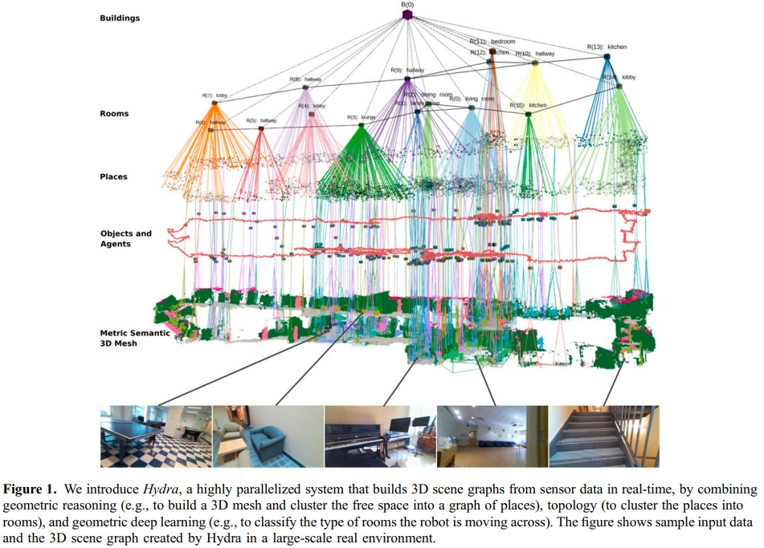
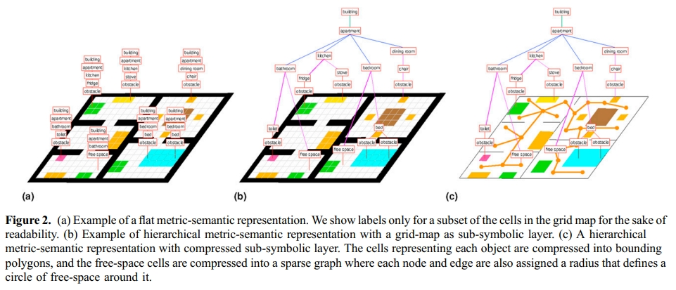

<!-- * 目录
{:toc} -->

# 引言
之前博客[《Spatial Foundation Model/通用 3D 基础模型/Spatial Intelligence》](https://kwanwaipang.github.io/Spatial-Foundation-Model/)对空间基础模型作了基本的论述，而此前博客[视觉SLAM](https://kwanwaipang.github.io/%E8%A7%86%E8%A7%89SLAM/)也对SLAM中的各种地图表达方式进行了介绍。虽然两个博客都有涉及机器人的3D 表征，但没有很系统性的，正好最近看的上交的一篇综述，打算深入阅读并记录。

本博文为学习笔记，仅供记录用～

这篇综述横跨了机器人3D表征近50年的发展历程（从1970s到2025年），系统性地将表征方式划分为 **几何表征（Geometric）**、**神经表征（Neural）** 以及 **基础模型表征（Foundation Model）** 三大阶段，并深入探讨了它们在感知（Perception）、定位建图（Localization & Mapping）以及交互（Interaction，包括导航与操纵）中的应用。

# 一、 3D场景表征：机器人的“世界观”

在机器人学中，3D场景表征（Representation）是连接传感器输入与动作输出的桥梁。一个理想的表征应当具备以下属性：
1. **几何精确性（Geometric Accuracy）**：用于避障和运动规划。
2. **外观写实性（Photo-realism）**：用于视觉定位和高质量渲染。
3. **语义丰富性（Semantic Richness）**：用于高级任务理解与语言交互。
4. **计算高效性（Computational Efficiency）**：满足移动端实时运行的需求。

论文将这50年的演进通过一张宏大的时间轴展现出来：从早期的栅格地图到点云，从NeRF到3DGS，再到如今将3D世界Token化并喂给Transformer，表征的维度正在从单纯的“点位”向“高维特征”跃迁。

---

# 二、 第一阶段：几何表征（Geometric Representations）—— 经典的基石

几何表征是机器人领域研究最久、应用最成熟的方案。它直接描述物体的形状和空间的占据情况。

## 2.1 点云（Point Clouds）
点云是3D传感器（LiDAR, RGB-D）的直接输出。
* **数学定义**：$P = \{p_i \mid p_i \in \mathbb{R}^3, i=1,...,n\}$，每个点包含$(x, y, z)$，有时包含颜色$(r, g, b)$或反射强度。
* **深度解读**：
    * **优点**：离散、简单、保留了最原始的传感器几何信息。
    * **缺点**：缺乏拓扑结构（无法知道点与点之间是否属于同一个面），且在稀疏情况下难以进行精细的物理碰撞检测。
    * **演进**：从传统的ICP匹配到基于深度学习的PointNet系列。

## 2.2 体素与占用地图（Voxels & Occupancy Grids）
体素是2D像素在3D空间的延伸。
* **定义**：将空间量化为规则的立方体，每个格点存储占据概率 $P(o)$。
* **关键算法**：
    * **OctoMap**：通过八叉树结构解决了大规模场景下体素存储爆炸的问题。
    * **VoxelMap**：在LiDAR SLAM中通过自适应体素提高建图精度。
* **评价**：体素是避障规划的最爱，因为它能明确告诉机器人“哪里不能去”。

## 2.3 网格（Meshes）
Mesh由顶点（Vertices）、边（Edges）和面片（Faces）组成。
* **应用**：在机器人仿真（Gazebo, Isaac Gym）和图形学渲染中是标准格式。
* **痛点**：拓扑变化时的更新非常困难，在动态建图中不如点云灵活。

## 2.4 符号距离函数（SDF/TSDF）
SDF不再记录“有没有”，而是记录“有多远”。
* **数学定义**：对于空间任一点 $x$，$f(x)$ 表示 $x$ 到最近表面的带符号距离。$f(x)=0$ 即代表物体表面。
* **机器人的意义**：SDF非常适合轨迹优化，因为它可以提供梯度信息，引导机器人远离障碍物（梯度指向远离表面的方向）。

## 2.5 场景图（Scene Graphs）
这是一种更高层的抽象，将场景组织为层级结构：房屋 -> 房间 -> 物体 -> 零部件。
* **3D Dynamic Scene Graphs (DSG)**：代表作如 **Hydra**。它不仅记录了几何，还记录了物体间的语义拓扑关系。

## 2.6 点图与动态点图

动态点图（[Dynamic Point Maps](https://arxiv.org/pdf/2503.16318), DPMs），它扩展了点图的概念，使其能够同时表示场景的3D形状和运动。

一个DPM可以表示为 $P_{i}(t_{j}, \pi_{k})$，它是一个点云图像。这个公式的含义是：
* $i$: 表示这个点云是与输入图像 $I_{i}$ 的像素对应的。
* $t_{j}$: 表示点云中3D点的位置是在时间戳$t_{j}$时刻的。
* $\pi_{k}$: 表示3D点的坐标是在相机$\pi_{k}$的坐标系下表达的。
  
DPM的强大之处在于，它将3D点与特定的视角(viewpoint)和时间(time) 解耦。例如，通过比较 $P_{0}(t_{0}, \pi_{0})(u)$ 和 $P_{1}(t_{0}, \pi_{0})(v)$是否相等，我们可以在同一个坐标系($\pi_{0}$)和同一个时刻($t_{0}$)下,判断来自不同图像$I_{0}$和$I_{1}$的两个像素$u$和$v$是否对应同一个3D点，即使这个点在两张图拍摄期间发生了移动。而一个点在不同时刻的位置之差，如$P_{0}(t_{1}, \pi_{0})(u) - P_{0}(t_{0}, \pi_{0})(u)$ ，则直接给出了该点的场景流（Scene Flow）或3D运动。

---

# 三、 第二阶段：神经表征（Neural Representations）—— 连续与写实的跨越

2020年后，NeRF的出现彻底改变了我们对“地图”的认知。地图不再是一堆点或格子，而是一个神经网络。

## 3.1 神经辐射场（NeRF）
* **核心原理**：用一个MLP $F_\theta: (x, d) \to (c, \sigma)$ 来表示场景。输入位置 $x$ 和视角 $d$，输出颜色 $c$ 和密度 $\sigma$。
* **体积渲染（Volume Rendering）**：
  $$C(r) = \int_{t_n}^{t_f} T(t) \sigma(r(t)) c(r(t), d) dt$$
* **机器人领域的困境**：
    * **慢**：训练和渲染都极耗计算资源，难以实时 SLAM。
    * **几何崩坏**：NeRF主要优化视觉损失，其内部学习到的几何有时会出现“空洞”或“浮点”。

## 3.2 3D高斯泼溅（3D Gaussian Splatting, 3DGS）
3DGS是2023年后的绝对主角，它结合了显式（点云状）和隐式（可微渲染）的优点。
* **表征方式**：由数百万个各向异性高斯分布组成。
  $$G(x) = \exp\left(-\frac{1}{2}(x-\mu)^T \Sigma^{-1} (x-\mu)\right)$$
* **为什么3DGS对机器人很重要？**
    1. **快**：支持100+ FPS实时渲染。
    2. **显式性**：均值 $\mu$ 本身就是点云，方便做碰撞检测。
    3. **可编辑性**：比NeRF更容易通过移动高斯球来模拟物体搬运。

---

# 四、 第三阶段：基础模型（Foundation Models）—— 走向通才机器人

这是目前（2024-2025年）最前沿的方向，即将3D场景转化为大模型（LLM/VLM）能理解的“语言”。

## 4.1 场景Token化（Scene Tokenization）
为了让Transformer处理3D，必须将场景离散化。
* **方法**：利用类似 VQ-VAE 的技术，将点云或体素 patch 映射为特定的 Codebook 索引（Token）。
* **代表作**：**MeshGPT**, **Pano-Language**。

## 4.2 视觉-语言-动作（VLA）模型
将3D表征与语义对齐。例如，当你对机器人说“去厨房拿那个红色的杯子”，机器人不再是根据坐标导航，而是根据表征中的**语义语义特征流**进行匹配。
* **Open-Vocabulary Map**：如 **ConceptFusion**, **VLMaps**。它们在3D地图的每一个格子上不仅存储几何，还存储了来自 CLIP 模型的特征向量。

---

# 五、 机器人核心任务中的表征博弈

## 5.1 感知任务（Perception）
* **3D检测与分割**：早期用点云卷积（PointConv），现在倾向于用多模态大模型（如 **SAM3D**）直接在神经表征上进行分割。
* **关键点提取**：神经表征能提供更稳定的关键点，辅助机器人抓取精细物体。

## 5.2 SLAM（定位与建图）
* **传统 vs 神经**：
    * 传统 SLAM（如 ORB-SLAM3）依然是实时性之王，但在低纹理、强反光环境下经常失败。
    * 神经 SLAM（如 **GS-SLAM**, **SplaTAM**）利用3DGS作为底图，能实现照片级的重构，且位姿跟踪精度正在追赶传统方法。

## 5.3 交互：操纵（Manipulation）与 导航（Navigation）
* **操纵**：需要极其精确的接触几何。SDF和Mesh仍是主流。但最近的研究（如 **GraspNeRF**）表明，神经表征可以处理透明/高反光物体的抓取难题。
* **导航**：
    * **几何导航**：解决“怎么走不撞”。
    * **语义导航**：解决“去哪儿”。
    * **生成式导航**：利用大模型生成导航代码或动作序列。

---

# 六、 终极辩论：谁才是“最好的”表征？

论文深入讨论了目前学术界的分歧。

### 6.1 模块化还是端到端？
* **模块化（Modular）**：将地图分为几何层、语义层、拓扑层。每一层服务于特定的算法。优点是可解释、安全；缺点是误差累积。
* **统一化（Unified/Foundation Model）**：直接把传感器输入转化成行为 Token。优点是潜力上限极高，能够处理极复杂的指令；缺点是“黑盒”，难以保证安全边界。

### 6.2 各种表征性能对比大表（核心干货）

| 表征方式 | 实时性 | 几何精度 | 语义能力 | 渲染质量 | 典型算法 |
| :--- | :--- | :--- | :--- | :--- | :--- |
| **点云** | 极高 | 高 | 低 | 极低 | ICP, PointNet |
| **TSDF** | 高 | 极高 | 低 | 中 | KinectFusion |
| **NeRF** | 低 | 中 | 中 | 极高 | iMAP, NICE-SLAM |
| **3DGS** | 高 | 高 | 中 | 极高 | GS-SLAM, Splat-Nav |
| **Token化** | 中 | 中 | 极高 | 中 | RT-2, MeshGPT |

---

# 七、 未来趋势：机器人3D表征的下半场

1. **从静态到动态（Static to Dynamic）**：
   现实世界是流动的。如何表征非刚体（如被扯动的布料、流体）是神经表征目前的重难点。
2. **生成式仿真（Generative World Models）**：
   机器人不再需要人类手动搭建仿真场景，而是通过大模型生成无限的 3D 训练数据（World Models）。
3. **硬件协同（Hardware-Algorithm Co-design）**：
   未来的机器人芯片可能不再是纯CPU/GPU，而是针对高斯泼溅或Transformer Token推理专门优化的NPU。

# 八、补充
除了上文阐述的三大类表征，机器人领域还存在其他一些有价值的表征范式，例如分层混合表征。这类方法试图融合不同表征的优势，以应对复杂任务的需求。

## 3D Sence Graph

这部分内容基于MIT LIDS实验室发表于IJRR 2024的工作——[Hydra](https://journals.sagepub.com/doi/pdf/10.1177/02783649241229725)。
传统的机器人地图（如SLAM生成的栅格地图或点云）主要关注几何信息，能回答“这里有没有障碍物？”，但无法回答“这是什么？”。后续出现的“扁平化”语义地图虽然为点或体素添加了标签（如“墙壁”、“椅子”），但在大规模场景下面临两大挑战：
1. 存储爆炸：一个办公楼层的地图可能就需要数百MB，城市级地图的存储成本难以想象。
2. 推理低效：在海量、无结构的语义标签中进行查询和规划，速度非常缓慢。

研究团队指出，解决这些问题的关键在于层次化（Hierarchy）。就像人脑的认知方式一样，机器人也需要一个从具体到抽象的多层级环境模型。这种模型不仅要存储高效，还需支持快速的语义推理与任务规划。

Hydra的核心贡献是能够实时构建并维护一个分层的3D场景图。这个图结构如同一个金字塔，从底层的详细几何到顶层的抽象概念，信息逐级浓缩。如下图所示：

  
   
<figcaption>  
</figcaption>

Hydra的场景图主要包含以下五个层次：
* 第1层：度量-语义网格（Metric-Semantic Mesh）：最底层，是由带语义标签的3D三角网格构成的场景基础几何。
* 第2层：物体与智能体（Objects and Agents）：从网格中实例分割出的独立物体（如椅子、桌子）以及机器人自身。
* 第3层：场所（Places）：对环境中的“自由空间”进行拓扑建模。它是一个稀疏图，节点代表“可活动区域”，边代表区域间的连通性，是实现高效路径规划的关键。
* 第4层：房间（Rooms）：将“场所”节点聚类为具有语义意义的房间（如厨房、卧室）。
* 第5层：建筑（Buildings）：最高层，将所有房间组织成一个完整的建筑单元。

Hydra的突出优势在于其实时、增量式的构建与维护能力：
1. 增量式前端构建：随着机器人移动，系统实时地、自底向上地逐层更新场景图。
2. 长期持久化与后端优化：系统后端负责处理长时运行中的累积误差（如里程计漂移），并对场景图进行全局优化与修正。

除了上述这种传统的sense graph也有基于VLM的开放词汇地图，如
* [OpenGraph](https://arxiv.org/pdf/2403.09412):利用VLM作为认知前端，从视觉图像中分割实例并且生成语言文本（captions）。LLM基于这些captions再进行推理；接下来将2D图像特征投影到3D雷达上。

# 结语
综述阅读完，最深刻的感受是：**没有绝对最好的表征，只有最适合任务的表征。** 如果你在做高速避障，点云和体素是你的战友；如果你在做智能管家，3DGS + 语义基础模型才是未来的通途。

正如论文最后引用的那样：机器人学正从“感知世界”走向“理解并模拟世界”。

# 参考资料
* [综述精读 上海交通大学：机器人3D表征的50年迭代史](https://mp.weixin.qq.com/s/nABblv57u2FQc4x2_sgddQ)
* [What Is The Best 3D Scene Representation for Robotics? From Geometric to Foundation Models](https://arxiv.org/pdf/2512.03422v1)
* [Awesome 3D Scene Representation for Robotics](https://github.com/dtc111111/awesome-representation-for-robotics)
