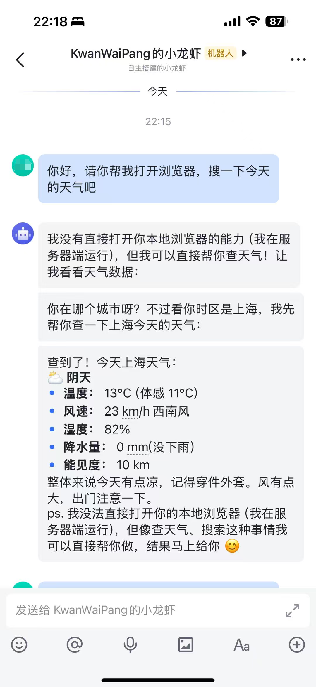
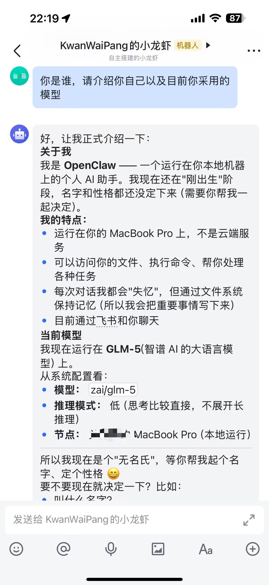
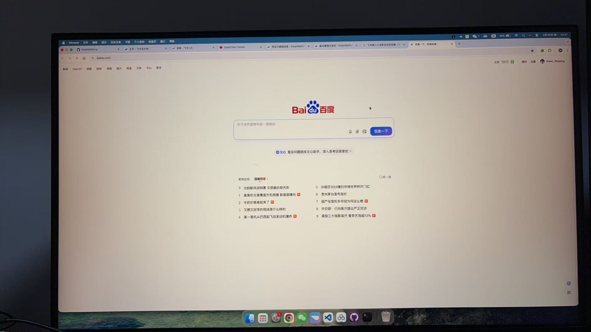

<!-- * 目录
{:toc} -->


# 引言

本文以飞书接入为例，开展OpenClaw的部署。

PS：飞书提供一键部署功能，但似乎每天的对话额度是有限的


# MacOS安装OpenClaw

1. 根据[官方指南](https://docs.openclaw.ai/start/getting-started)，执行以下安装命令，安装 OpenClaw：

```bash
curl -fsSL https://openclaw.ai/install.sh | bash   
```

* 如果遇到报错信息显示：`unknown or unsupported macOS version: "26.2"`,通常是因为你的 Homebrew 版本过旧，无法识别你当前的 macOS 系统版本:

```bash
# 替换 Brew 核心仓库
export HOMEBREW_BREW_GIT_REMOTE="https://mirrors.ustc.edu.cn/brew.git"

# 替换 Core 仓库
export HOMEBREW_CORE_GIT_REMOTE="https://mirrors.ustc.edu.cn/homebrew-core.git"

# 尝试更新
brew update

brew --version #确认是否为较新版本
```

一键安装，这个流程如下图所示

<div align="center">
  
<figcaption>  
</figcaption>
</div>

接下来需要选择模型：

<div align="center">
  
<figcaption>  
</figcaption>
</div>

可以先不配置，跳过，然后选择模型的厂商，选择All，然后选择默认的模型

<div align="center">
  
  
<figcaption>  
</figcaption>
</div>

接下来选择渠道目前先跳过，后续会用飞书

<div align="center">
  
<figcaption>  
</figcaption>
</div>

接下来能跳过都优先选择跳过。

<div align="center">
  
<figcaption>  
</figcaption>
</div>

最后选择web ui就可以正常打开了：

<div align="center">
  <table style="border: none; background-color: transparent;">
    <tr align="center">
      <td style="width: 50%; border: none; padding: 0.01; background-color: transparent; vertical-align: middle;">
        
      </td>
      <td style="width: 50%; border: none; padding: 0.01; background-color: transparent; vertical-align: middle;">
        
      </td>
    </tr>
  </table>
  <figcaption>
  </figcaption>
</div>


通过下面命令，确定OpenClaw在运行：

```bash
openclaw onboard --install-daemon #重新开启选模型/运行新手引导

openclaw gateway status #看到 “running” 就说明一切 OK！

openclaw dashboard #打开控制面板

openclaw doctor #快速检查当前是否有问题


openclaw status #检查网关状态

# 打开浏览器
http://127.0.0.1:18789/
# OpenClaw 的控制面板，你可以在这里跟你的 AI 助手聊天了。
```

对于运行`openclaw status`,可以看到目前的状态：

<div align="center">
  
<figcaption>  
</figcaption>
</div>

但当前使用聊天框，还是没有任何响应的，接下来接入deepseek的API key，访问[网页](https://platform.deepseek.com/api_keys)，获取api key之后用如下命令设置：

```bash
openclaw config 
然后选择local
然后选择model
再选择DeepSeek然后输入自己的api key
然后点击continue
```

好吧，要充值才可以使用。接下来改为用[big model](https://bigmodel.cn/)，注册就可以送token，在model选Z.AI,然后选择CN，再输入API key，然后重新刷新应该就可以用了～

<div align="center">
  
<figcaption>  
</figcaption>
</div>


# 接入飞书
配置的过程有点复杂，主要参考流程[OpenClaw部署与配置教程：在Mac mini上接入国产大模型与飞书](https://damodev.csdn.net/697dff7b7c1d88441d90f0e4.html)，有几个关键点：
1. 需保持电脑端打开`openclaw gateway`
2. 配置过程有问题可以用小龙虾来配置

<div align="center">
  <table style="border: none; background-color: transparent;">
    <tr align="center">
      <td style="width: 50%; border: none; padding: 0.01; background-color: transparent; vertical-align: middle;">
        
      </td>
      <td style="width: 50%; border: none; padding: 0.01; background-color: transparent; vertical-align: middle;">
        
      </td>
    </tr>
  </table>
  <figcaption>
  </figcaption>
</div>

<div align="center">
  <table style="border: none; background-color: transparent;">
    <tr align="center">
      <td style="width: 50%; border: none; padding: 0.01; background-color: transparent; vertical-align: middle;">
        
      </td>
      <td style="width: 50%; border: none; padding: 0.01; background-color: transparent; vertical-align: middle;">
        
      </td>
    </tr>
  </table>
  <figcaption>
  </figcaption>
</div>


# 参考资料
* [openclaw官网](https://docs.openclaw.ai/zh-CN)
* [OpenClaw 快速部署：菜鸟素人上手教程](https://zhuanlan.zhihu.com/p/2012863713577805230)
* [OpenClaw 飞书官方插件使用指南（公开版）](https://bytedance.larkoffice.com/docx/MFK7dDFLFoVlOGxWCv5cTXKmnMh)


