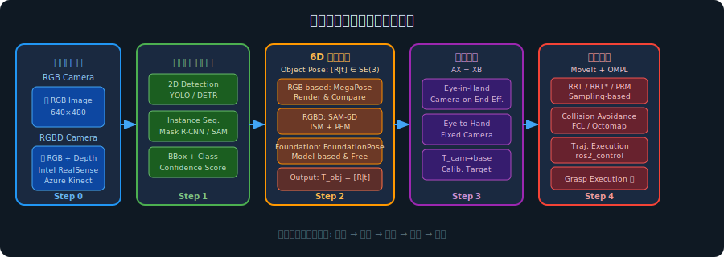
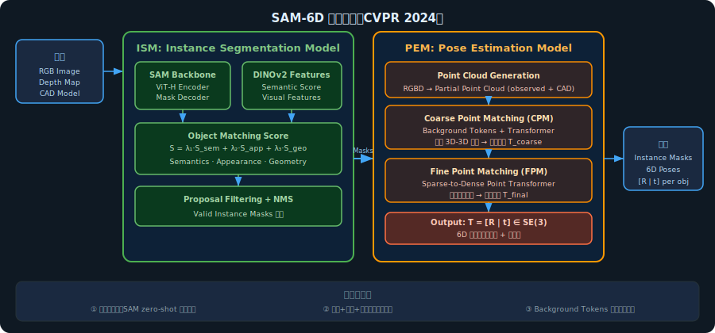
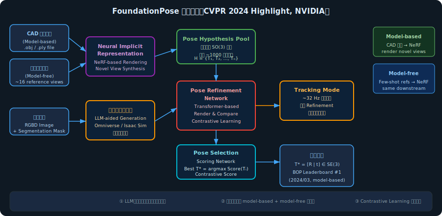
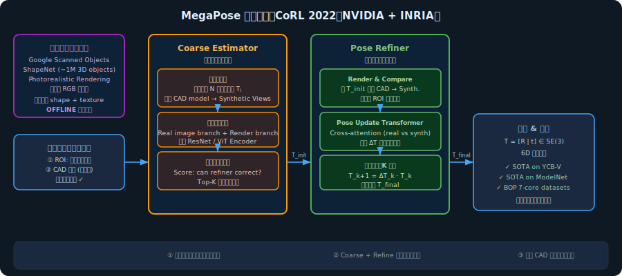
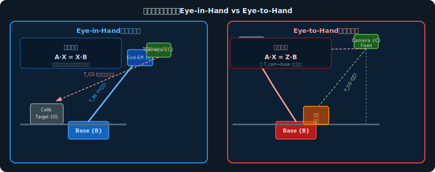
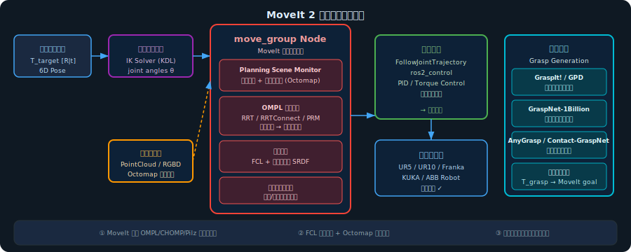

<!-- * 目录
{:toc} -->


# 引言

机械臂视觉抓取（Visual Grasping）是机器人领域的核心技术之一，其目标是赋予机械臂"看懂"三维世界并准确完成物体拾取的能力。从工业流水线的精密装配，到仓储物流的柔性拣选，再到医疗辅助机器人的精细操作，视觉引导的机械臂抓取正以前所未有的速度走进现实应用。

一套完整的视觉抓取系统并不简单，它涉及多个高度耦合的技术模块：首先需要从摄像头图像中**检测并定位**目标物体（目标检测）；进一步需要精确估计物体在三维空间中的**六自由度姿态**（6D Pose Estimation），即物体相对于相机的旋转矩阵 $\mathbf{R} \in SO(3)$ 和平移向量 $\mathbf{t} \in \mathbb{R}^3$；然后通过**手眼标定**（Hand-Eye Calibration）建立相机坐标系与机械臂基座坐标系之间的变换关系，从而将感知到的物体位姿转换到机械臂可操作的坐标空间；最后利用**运动规划**（Motion Planning）为机械臂规划一条安全、无碰撞的运动轨迹以完成抓取。

下图展示了整个视觉抓取流水线的技术框架，也是本文行文逻辑的主轴：



**图1：机械臂视觉抓取完整技术路线图**（Step 0：传感器输入 → Step 1：目标检测与定位 → Step 2：6D 姿态估计 → Step 3：手眼标定 → Step 4：运动规划与执行）

近年来，随着深度学习的爆发式发展，尤其是基础模型（Foundation Models）的兴起，视觉抓取中的每个子模块都经历了深刻的变革：从依赖手工特征的传统方法，演进到端到端可学习的深度神经网络，再到零样本泛化的大模型范式。本文将沿着上述技术路线，对每个模块进行系统且深入的介绍，并重点剖析 **SAM-6D**、**FoundationPose** 和 **MegaPose** 三个在6D姿态估计领域具有里程碑意义的工作。

---

# 一、传感器输入：RGB 与 RGB-D

## 1.1 纯 RGB 相机

早期视觉抓取大量依赖普通单目 RGB 相机（如 USB 摄像头、工业相机）。RGB 图像提供丰富的纹理与颜色信息，但缺乏直接的深度信息，三维重建需要借助几何先验或多视角约束。

**内参标定**是使用相机前的必要步骤。相机的针孔投影模型将三维点 $\mathbf{P}_c = (X_c, Y_c, Z_c)^\top$ 映射到图像像素坐标 $(u, v)$：

$$
\begin{bmatrix} u \\ v \\ 1 \end{bmatrix} = \frac{1}{Z_c} \mathbf{K} \mathbf{P}_c, \quad \mathbf{K} = \begin{bmatrix} f_x & 0 & c_x \\ 0 & f_y & c_y \\ 0 & 0 & 1 \end{bmatrix}
$$

其中 $f_x, f_y$ 为焦距（像素单位），$(c_x, c_y)$ 为主点坐标。实际相机还存在径向畸变和切向畸变，需通过棋盘格标定（Zhang's method，Zhang 1999）估计畸变系数 $\mathbf{d} = (k_1, k_2, p_1, p_2, k_3)$。

## 1.2 RGB-D 相机（深度相机）

RGB-D 相机在提供彩色图像的同时，还直接输出**逐像素深度值** $d(u,v)$（单位：毫米或米），极大地简化了三维感知。常见的 RGB-D 传感器包括：

- **Intel RealSense D系列**（如 D435, D455）：基于结构光 + 主动红外的立体视觉，适合室内近距离（0.2m–10m）使用；
- **Microsoft Azure Kinect DK**：搭载 ToF（飞行时间）深度传感器，精度高，适合机器人操作；
- **Orbbec Gemini / Femto**：国产 RGB-D 方案，成本较低。

给定深度值 $d(u,v)$，可将像素反投影为相机坐标系下的三维点：

$$
X_c = \frac{(u - c_x) \cdot d(u,v)}{f_x}, \quad Y_c = \frac{(v - c_y) \cdot d(u,v)}{f_y}, \quad Z_c = d(u,v)
$$

将场景中所有像素反投影后，得到**点云（Point Cloud）**，这是后续6D姿态估计和运动规划的重要输入。

---

# 二、目标检测与定位

目标检测（Object Detection）是整个流水线的入口，其任务是在图像中找到目标物体的位置并给出类别标签，为后续姿态估计提供**感兴趣区域（Region of Interest, ROI）**。

## 2.1 经典 2D 检测方法

### YOLO 系列

YOLO（You Only Look Once）系列是目前工业界使用最广泛的实时目标检测框架。其核心思想是将检测任务转化为一次前向推理的回归问题：将图像划分为 $S \times S$ 的网格，每个格子直接预测 $B$ 个边界框（bounding box）及其置信度，同时预测类别概率。

从 YOLOv1（2016）到 YOLOv8/YOLOv10（2023–2024），检测精度与速度持续提升。以 YOLOv8 为例，其在 COCO 数据集上 mAP 达到 50.2%，推理速度在 RTX 3080 GPU 上可达数百帧/秒，满足机器人实时性要求。

损失函数形式为：

$$
\mathcal{L} = \lambda_{coord} \sum_{i,j} \mathbb{1}_{ij}^{obj} \left[(x_i - \hat{x}_i)^2 + (y_i - \hat{y}_i)^2 + (\sqrt{w_i} - \sqrt{\hat{w}_i})^2 + (\sqrt{h_i} - \sqrt{\hat{h}_i})^2\right] + \mathcal{L}_{cls} + \mathcal{L}_{conf}
$$

### Transformer-based Detection：DETR

DETR（Detection Transformer，Carion et al., ECCV 2020）彻底抛弃了 anchor 机制和 NMS 后处理，利用 Transformer 的全局注意力机制将检测建模为集合预测问题（set prediction）：

$$
\mathcal{L}_{match} = \sum_{i} \left[ -\log \hat{p}_{\sigma(i)}(c_i) + \mathbb{1}_{c_i \neq \varnothing} \mathcal{L}_{box}(b_i, \hat{b}_{\sigma(i)}) \right]
$$

通过匈牙利算法（Hungarian Algorithm）在预测集合与真值集合之间寻找最优二分匹配 $\sigma$，实现端到端训练，无需复杂的后处理流程。

## 2.2 实例分割：Mask R-CNN 与 SAM

对于视觉抓取任务，仅有边界框往往不够——精确的**实例掩码（Instance Mask）**能更好地描述物体的形状边界，为点云裁剪和姿态估计提供更干净的输入。

**Mask R-CNN**（He et al., ICCV 2017）在 Faster R-CNN 基础上增加了掩码预测分支，以 RoIAlign 操作代替 RoIPool，避免了量化误差对掩码精度的影响。它已成为机器人视觉中实例分割的事实标准基线。

**Segment Anything Model（SAM）**（Kirillov et al., ICLR 2024）是 Meta 发布的基础分割模型，通过在超过 1 亿张掩码数据上训练，实现了强大的**零样本分割能力**（Zero-shot Segmentation）。SAM 接受多种提示（点、框、文本）生成高质量掩码，在机器人视觉中被广泛用于新物体的实例分割（如后文将介绍的 SAM-6D 即以 SAM 为分割主干）。

## 2.3 2D 检测到 3D 定位的过渡

纯2D检测只能获得物体在图像平面的位置（边界框或掩码）。在 RGB-D 相机下，结合深度图可以轻松获取物体的粗略3D位置（通过掩码内深度值的中位数或中心点反投影）。但这只是**位置（translation）**的粗估，缺乏**姿态（rotation）**的精确信息——这正是6D姿态估计要解决的核心问题。

---

# 三、6D 物体姿态估计

## 3.1 问题定义与数学表述

**6D 物体姿态估计**的目标是：给定场景图像（RGB 或 RGB-D）和目标物体的 CAD 模型，求解物体坐标系相对于相机坐标系的**刚体变换矩阵** $\mathbf{T} \in SE(3)$：

$$
\mathbf{T} = \begin{bmatrix} \mathbf{R} & \mathbf{t} \\ \mathbf{0}^\top & 1 \end{bmatrix}, \quad \mathbf{R} \in SO(3),\; \mathbf{t} \in \mathbb{R}^3
$$

$\mathbf{R}$ 为 $3 \times 3$ 的旋转矩阵（满足 $\mathbf{R}^\top \mathbf{R} = \mathbf{I}$，$\det(\mathbf{R}) = 1$），$\mathbf{t}$ 为三维平移向量。物体坐标系中的点 $\mathbf{p}_{obj}$ 通过此变换投影到相机坐标系：

$$
\mathbf{p}_{cam} = \mathbf{R} \mathbf{p}_{obj} + \mathbf{t}
$$

旋转矩阵的参数化方式多种多样，常见的有：
- **欧拉角（Euler Angles）**：直观但存在万向锁（Gimbal Lock）问题；
- **四元数（Quaternion）** $\mathbf{q} = (q_w, q_x, q_y, q_z)$，$\|\mathbf{q}\|=1$：紧凑、无奇异性，神经网络常用；
- **轴角（Axis-Angle）**：适合小旋转的迭代优化；
- **旋转向量（Rodrigues' rotation formula）**：
$$
\mathbf{R} = \mathbf{I} + \sin\theta [\hat{\mathbf{k}}]_\times + (1 - \cos\theta) [\hat{\mathbf{k}}]_\times^2
$$
其中 $[\hat{\mathbf{k}}]_\times$ 为旋转轴 $\hat{\mathbf{k}}$ 的反对称矩阵，$\theta$ 为旋转角。
- **6D 旋转表示（Zhou et al., CVPR 2019）**：适合神经网络连续表示旋转，取旋转矩阵前两列 $(r_1, r_2) \in \mathbb{R}^6$，通过 Gram-Schmidt 正交化恢复完整 $\mathbf{R}$，已被众多6D估计网络采用。

## 3.2 方法分类概述

6D 姿态估计方法可按多个维度分类：

| 维度 | 类别 | 代表方法 |
|---|---|---|
| **输入模态** | RGB | MegaPose（coarse）, GDR-Net |
| | RGB-D | SAM-6D, PVNet, DenseFusion |
| **目标泛化性** | Instance-level | PoseCNN, DeepIM |
| | Category-level | NOCS, SPD |
| | Novel Object (Zero-shot) | MegaPose, SAM-6D, FoundationPose |
| **核心思路** | Render & Compare | MegaPose, FoundationPose |
| | Keypoint-based | PVNet, PVNN |
| | Point Matching | SAM-6D (PEM), PointDAN |
| | Direct Regression | SSD-6D, EfficientPose |

当前最受关注的是**零样本新物体（Zero-shot Novel Object）**范式：训练时不接触目标物体，测试时仅凭 CAD 模型即可泛化到任意新物体，这对机器人的快速部署至关重要。

## 3.3 SAM-6D（CVPR 2024）

### 3.3.1 方法概述

**SAM-6D** 由香港科技大学和 DexForce 公司联合提出，发表于 CVPR 2024（Lin et al., 2024）。其核心思想是：借助 **Segment Anything Model（SAM）** 强大的零样本实例分割能力，以 RGB-D 图像为输入，实现新物体的零样本6D姿态估计。

SAM-6D 将整个任务分解为两个子网络：**实例分割模型（Instance Segmentation Model, ISM）** 和 **姿态估计模型（Pose Estimation Model, PEM）**。



**图2：SAM-6D 整体架构**

### 3.3.2 实例分割模型（ISM）

ISM 的工作流程如下：

**Step 1：生成所有可能的掩码候选**。以 SAM 的 ViT-H 编码器（约 600M 参数）提取图像特征，通过 SAM 的掩码解码器生成类别无关（class-agnostic）的所有可能掩码候选集合 $\{\mathcal{M}_k\}$。

**Step 2：计算三重对象匹配分数**。对每个候选掩码 $\mathcal{M}_k$，计算其与目标物体的匹配得分：

$$
S_k = \lambda_1 \cdot S_{sem}(\mathcal{M}_k) + \lambda_2 \cdot S_{app}(\mathcal{M}_k) + \lambda_3 \cdot S_{geo}(\mathcal{M}_k)
$$

- **语义匹配分数** $S_{sem}$：利用 DINOv2 提取目标物体的多视角渲染特征与候选掩码区域特征的余弦相似度，衡量语义一致性；
- **外观匹配分数** $S_{app}$：在更细粒度的外观层面比较纹理和颜色分布；
- **几何匹配分数** $S_{geo}$：将掩码对应的深度点云与物体 CAD 模型点云对比，通过 ICP（迭代最近点）或特征匹配计算几何相似度。

**Step 3：非极大值抑制（NMS）和阈值过滤**，保留得分最高的有效实例掩码。

### 3.3.3 姿态估计模型（PEM）

PEM 将姿态估计建模为**部分到部分的点云匹配问题（Partial-to-Partial Point Matching）**，核心创新是引入了**背景令牌（Background Tokens）**。

**数据准备**：从 RGB-D 图像中，利用 ISM 得到的掩码裁出观测点云 $\mathcal{P}_{obs}$（部分可见）；从物体 CAD 模型中均匀采样得到完整点云 $\mathcal{P}_{cad}$。

**两阶段点匹配流程**：

**阶段一：粗粒度点匹配（Coarse Point Matching, CPM）**

$$
\mathbf{F}_{obs}, \mathbf{F}_{cad} = \text{PointTransformer}(\mathcal{P}_{obs}, \mathcal{P}_{cad})
$$

在 Transformer 的注意力计算中，引入背景令牌 $\mathbf{B} \in \mathbb{R}^{N_b \times d}$：

$$
\text{Attention}(\mathbf{Q}, [\mathbf{K}_{pts} | \mathbf{K}_{bg}], [\mathbf{V}_{pts} | \mathbf{V}_{bg}])
$$

背景令牌充当软性"垃圾桶"，吸收那些在对应物体点云中找不到匹配点的观测点（因遮挡、截断等原因），防止错误对应关系污染匹配矩阵。通过 Sinkhorn 算法求解最优部分匹配矩阵，得到稀疏3D-3D对应，利用 Kabsch-Umeyama 算法估计粗略姿态 $\mathbf{T}_{coarse}$。

**阶段二：精细点匹配（Fine Point Matching, FPM）**

以 $\mathbf{T}_{coarse}$ 初始化，利用 **Sparse-to-Dense Point Transformer** 在更多细粒度点上建立密集对应关系，进一步精化为最终姿态 $\mathbf{T}_{final}$。

整个 PEM 的训练目标为：

$$
\mathcal{L}_{PEM} = \mathcal{L}_{coarse} + \alpha \mathcal{L}_{fine} = \sum_{(i,j) \in \mathcal{C}^*} \text{BCE}(\hat{a}_{ij}, 1) + \sum_{(i,j) \notin \mathcal{C}^*} \text{BCE}(\hat{a}_{ij}, 0) + \alpha \mathcal{L}_{geo}
$$

其中 $\mathcal{C}^*$ 为真值对应集合，BCE 为二元交叉熵，$\mathcal{L}_{geo}$ 为基于预测姿态的几何重投影损失。

### 3.3.4 性能表现

SAM-6D 在 BOP Benchmark 的七个核心数据集（YCB-V, LM-O, HB, T-LESS, IC-BIN, ITODD, TUD-L）上均达到了当时的最优性能，mean AR（Average Recall）达到 **70.4%**（使用自身 ISM 分割时），超越了所有已有的零样本6D姿态估计方法。

### 3.3.5 优缺点分析

| 维度 | 优点 | 缺点 |
|---|---|---|
| **泛化性** | 零样本，无需目标物体参与训练 | 对无纹理物体性能下降 |
| **分割质量** | SAM 提供高质量掩码 | 分割 + 匹配串行，整体较慢（约几秒/帧）|
| **几何鲁棒性** | Background Tokens 显著提升遮挡场景精度 | 对严重截断的点云仍有挑战 |
| **精度** | BOP 七数据集 SOTA | 无实时追踪模式 |
| **工程实现** | 有官方 Docker 镜像 | 依赖深度相机（需 RGB-D）|

---

## 3.4 FoundationPose（CVPR 2024 Highlight，NVIDIA）

### 3.4.1 方法概述

**FoundationPose** 由 NVIDIA 研究院 Bowen Wen 等人提出，发表于 CVPR 2024（Highlight）。它是一个**统一基础模型**，同时支持：
- **Model-based**（基于 CAD 模型）的6D姿态估计与追踪；
- **Model-free**（无 CAD 模型，仅需少量参考图像）的6D姿态估计与追踪。

两种模式共享完全相同的下游姿态估计网络，通过神经隐式表示（Neural Implicit Representation / NeRF）消除两者差异，是该方法最核心的设计理念。在2024年3月，FoundationPose 登上 BOP Benchmark **model-based 新物体姿态估计排行榜第一名**。



**图3：FoundationPose 整体架构**

### 3.4.2 大规模合成训练数据生成

FoundationPose 的强泛化能力来源于**超大规模合成训练数据**。利用 NVIDIA Isaac Sim（基于 Omniverse）进行物理正确的光追渲染，并借助 **LLM（大语言模型）** 自动生成场景描述、材质配置和物体摆放方案，从而以极低的人工成本生成数以百万计的带标注训练样本。训练数据集 "FoundationPose Dataset" 已公开发布。

### 3.4.3 神经隐式表示（Neural Field）作为统一桥梁

为了统一 model-based 和 model-free 两种输入模式，FoundationPose 引入以物体为中心的神经场（Object-centric Neural Field）：

- **Model-based**：直接以 CAD 模型渲染新视角（无需学习）；
- **Model-free**：以约 16 张参考图像训练一个轻量 NeRF，学习物体的隐式三维表示，再通过 NeRF 合成任意新视角的 RGBD 图像；

两种方式最终都得到可用于 **Render & Compare** 的合成 RGBD 渲染图像，使下游姿态估计网络完全不感知输入模式的差异。

### 3.4.4 姿态假设生成与精化网络

**姿态假设生成（Pose Hypothesis Pool）**：
均匀采样旋转空间 $SO(3)$（通常约 1000 个候选），构成初始姿态假设集合：

$$
\mathcal{H} = \{(\mathbf{R}_i, \mathbf{t}_i)\}_{i=1}^{N}
$$

平移 $\mathbf{t}$ 由目标的深度中心点初始化。

**姿态精化网络（Pose Refinement Network）**：

对于每个假设姿态 $\mathbf{T}_i$，将 CAD 模型（或 NeRF 生成图像）在此姿态下渲染，得到合成 RGBD 图像 $I_{synth}(\mathbf{T}_i)$，与实际观测裁剪区域 $I_{obs}$ 拼接后送入 Transformer 编码器：

$$
\Delta \mathbf{T}_i = f_\theta([I_{obs} \oplus I_{synth}(\mathbf{T}_i)])
$$

精化后的姿态为：$\mathbf{T}_i' = \Delta \mathbf{T}_i \cdot \mathbf{T}_i$

网络 $f_\theta$ 是一个基于 Vision Transformer（ViT）的跨注意力架构，通过**对比学习（Contrastive Learning）**训练——使正确姿态的渲染与观测特征距离拉近，错误姿态的特征距离推远：

$$
\mathcal{L}_{contrastive} = -\log \frac{\exp(\mathbf{z}_{obs} \cdot \mathbf{z}^+_{synth} / \tau)}{\sum_j \exp(\mathbf{z}_{obs} \cdot \mathbf{z}^{(j)}_{synth} / \tau)}
$$

其中 $\tau$ 为温度系数，$\mathbf{z}^+$ 为正样本（真值姿态渲染），$\mathbf{z}^{(j)}$ 为负样本（错误姿态渲染）。

**姿态评分与选择（Pose Selection）**：

所有精化后的假设姿态通过评分网络获得置信分数 $s_i = g_\phi(\mathbf{T}_i')$，最终选择：

$$
\mathbf{T}^* = \mathbf{T}'_{\arg\max_i s_i}
$$

### 3.4.5 实时追踪模式

一旦完成初始化（姿态估计），系统切换为**追踪模式（Tracking Mode）**：无需重新生成假设池，仅对上一帧的姿态做一步精化，推理速度达到约 **32 Hz**，满足实时操作需求。

### 3.4.6 性能与优缺点

| 维度 | 优点 | 缺点 |
|---|---|---|
| **统一性** | 一个模型同时解决 model-based 和 model-free | 依赖外部 2D 检测器（CNOS/Mask-RCNN）|
| **精度** | BOP model-based 排行榜 #1 | 初始化阶段约 1.3s，追踪 32Hz |
| **泛化性** | 超大规模合成训练，强零样本泛化 | GPU 内存需求较高（RTX 3090） |
| **追踪** | 32 Hz 实时追踪，可切换模式 | 严重遮挡时仍可能失败 |
| **生态** | 支持 Isaac ROS / TensorRT 加速 | NVIDIA 专有许可证（非完全开源）|

---

## 3.5 MegaPose（CoRL 2022，NVIDIA + INRIA）

### 3.5.1 方法概述

**MegaPose** 由 Yann Labbé（INRIA）、Lucas Manuelli（NVIDIA）等人共同提出，发表于 CoRL 2022（Conference on Robot Learning）。MegaPose 是较早验证"**百万级合成数据 + Render & Compare**"范式在新物体零样本泛化上可行性的工作，也被认为是 FoundationPose 等后续大型方法的重要先驱。

其核心贡献有三：
1. 提出基于 Render & Compare 的**精化器（Refiner）**；
2. 提出利用可修正性分类的**粗略估计器（Coarse Estimator）**；
3. 发布包含数千种物体的**百万级合成训练数据集**。



**图4：MegaPose 整体架构**

### 3.5.2 大规模合成训练集

MegaPose 的训练集由两部分组成：
- **Google Scanned Objects（GSO）**：约 1000 种真实扫描物体，纹理丰富；
- **ShapeNet**：约 50,000 种 CAD 模型，形状多样但纹理有限；

结合随机背景、光照和摆放的 Physically-Based Rendering（PBR）渲染，最终生成 **ShapeNet-1M** 和 **GSO-1M** 两个百万帧合成数据集。训练后，MegaPose 可在**不重新训练**的前提下直接推理任意新物体。

### 3.5.3 粗略估计器（Coarse Estimator）

MegaPose 粗略估计器的核心问题是：**给定一张真实图像的裁剪区域（ROI）和一个新物体的 CAD 模型，如何在没有任何初始化的情况下估计物体姿态？**

**多视角渲染候选池**：对旋转空间 $SO(3)$ 均匀采样 $N$ 个姿态 $\{\mathbf{T}_j\}$，利用 CAD 模型渲染得到合成图像集合 $\{I_{synth}(\mathbf{T}_j)\}$。

**双流特征提取**：真实 ROI 图像和所有合成视图通过**权重共享**的骨干网络（ResNet 或 ViT）提取特征：

$$
\mathbf{f}_{obs} = \phi(I_{obs}), \quad \mathbf{f}_j = \phi(I_{synth}(\mathbf{T}_j))
$$

**可修正性分类器**：对每个候选姿态 $\mathbf{T}_j$，训练一个二分类器 $c_j = \sigma(\mathbf{w}^\top [\mathbf{f}_{obs}; \mathbf{f}_j])$，预测该候选姿态与真实姿态的误差是否在精化器可修正的范围内。选择得分最高的 Top-$K$ 候选姿态送入精化器。

这一设计的妙处在于：无需直接回归出精确姿态（这对大规模 $SO(3)$ 采样是困难的），而是将粗估问题转化为可修正性的分类问题，大大降低了学习难度。

### 3.5.4 精化器（Refiner）

精化器以粗略姿态为初始化，通过**迭代 Render & Compare** 精化姿态。

对于当前姿态估计 $\mathbf{T}_k$，渲染合成图像 $I_{synth}(\mathbf{T}_k)$，与真实 ROI 图像 $I_{obs}$ 拼接（沿通道方向）：

$$
[\mathbf{f}_{obs}, \mathbf{f}_{synth}] = \Phi(I_{obs}, I_{synth}(\mathbf{T}_k))
$$

经过跨注意力 Transformer 预测姿态更新量 $(\Delta \mathbf{R}, \Delta \mathbf{t})$：

$$
\mathbf{T}_{k+1} = \begin{bmatrix} \Delta \mathbf{R} & \Delta \mathbf{t} \\ \mathbf{0}^\top & 1 \end{bmatrix} \cdot \mathbf{T}_k
$$

迭代精化直到收敛（通常 5 步）。训练时对精化器使用如下自监督损失：

$$
\mathcal{L}_{refine} = \min_{\mathbf{s} \in Sym(\mathcal{O})} \| \mathbf{R}_{gt} \mathbf{s} - \hat{\mathbf{R}}\|_F + \lambda \|\mathbf{t}_{gt} - \hat{\mathbf{t}}\|_2
$$

其中 $Sym(\mathcal{O})$ 为物体对称群，对称处理避免了对称物体（如圆柱体）的姿态歧义问题。

### 3.5.5 追踪应用

在机器人操作演示中，MegaPose 以第一帧的完整 coarse + refine 流程初始化物体姿态，后续帧仅使用精化器做单步更新（利用上一帧姿态作为初始化），大幅提升运行速度。

### 3.5.6 性能与优缺点

| 维度 | 优点 | 缺点 |
|---|---|---|
| **先驱意义** | 开创百万级合成数据训练+新物体泛化范式 | 速度较慢（CPU+GPU 约数秒/帧）|
| **数据集** | 公开发布 ShapeNet-1M / GSO-1M | 点云方法不如 SAM-6D 鲁棒 |
| **泛化性** | 不需要目标物体参与训练 | 对 RGB-only 输入精度有限 |
| **机器人部署** | 提供完整机器人抓取演示 | 需要 ROI 提前给定（依赖检测器）|
| **可扩展性** | 代码和数据集完全开源（MIT 协议）| 后续被 FoundationPose 显著超越 |

---

## 3.6 三大方法横向比较

| 方法 | 会议 | 输入 | 范式 | BOP AR | 追踪 | 代码 |
|---|---|---|---|---|---|---|
| MegaPose | CoRL 2022 | RGB | Render & Compare | 竞争性 | ✓（单步精化）| 完全开源 |
| SAM-6D | CVPR 2024 | RGB-D | 点云匹配 | 70.4% mean AR | ✗ | 开源 |
| FoundationPose | CVPR 2024 Highlight | RGB-D | Render & Compare | **BOP #1** | ✓（32 Hz）| NVIDIA 许可 |

---

# 四、手眼标定

## 4.1 问题背景

传感器（相机）通常并不直接安装在机械臂末端执行器上——即使安装，相机坐标系和机械臂坐标系之间也存在未知的刚性变换。**手眼标定（Hand-Eye Calibration）** 的目的就是精确确定这一关键变换关系，使机械臂能够根据相机观测到的物体位姿，准确计算出到达目标的运动指令。



**图5：手眼标定两种经典配置**

## 4.2 两种安装配置

### Eye-in-Hand（随动式，相机装在末端）

相机固定安装在机械臂末端执行器（End-Effector）上，随末端运动。已知量包括：
- 末端坐标系到基座坐标系的变换 $\mathbf{T}_{BE}$（由机械臂正运动学 FK 给出）；
- 相机观测到标定目标（如棋盘格）的变换 $\mathbf{T}_{CO}$（由图像标定板检测给出）。

未知量为相机坐标系到末端执行器坐标系的变换 $\mathbf{X} = \mathbf{T}_{EC}$。

移动机械臂到两个不同位姿 $i$ 和 $j$，利用标定目标静止不动的约束：

$$
\mathbf{T}_{BE}^{(i)} \cdot \mathbf{T}_{EC} \cdot \mathbf{T}_{CO}^{(i)} = \mathbf{T}_{BE}^{(j)} \cdot \mathbf{T}_{EC} \cdot \mathbf{T}_{CO}^{(j)}
$$

整理得经典 **AX = XB** 方程：

$$
\mathbf{A} \mathbf{X} = \mathbf{X} \mathbf{B}
$$

其中 $\mathbf{A} = (\mathbf{T}_{BE}^{(j)})^{-1} \mathbf{T}_{BE}^{(i)}$，$\mathbf{B} = \mathbf{T}_{CO}^{(j)} (\mathbf{T}_{CO}^{(i)})^{-1}$，$\mathbf{X} = \mathbf{T}_{EC}$（未知）。

### Eye-to-Hand（固定式，相机固定在外部）

相机固定安装在机器人工作空间的外部支架上（不随末端运动）。标定板安装在末端执行器上。此时求解的未知量是相机坐标系到机械臂基座坐标系的变换 $\mathbf{T}_{CB}$，方程形式变为：

$$
\mathbf{A} \mathbf{X} = \mathbf{Z} \mathbf{B}
$$

其中 $\mathbf{Z}$ 为额外的机械臂基座到世界坐标系的变换（若基座固定则可合并），由 Zhuang et al. 1994 的方法联立求解。

## 4.3 求解方法

### 分离式闭合解（Separable Closed-form）

**Tsai-Lenz 方法**（IEEE T-RA 1989）：将 $\mathbf{A}\mathbf{X}=\mathbf{X}\mathbf{B}$ 分为旋转和平移两步求解。

将旋转矩阵 $\mathbf{R}_A$, $\mathbf{R}_X$, $\mathbf{R}_B$ 转化为旋转向量 $\mathbf{a} = \mathbf{r}_A$, $\mathbf{x} = \mathbf{r}_X$, $\mathbf{b} = \mathbf{r}_B$，则旋转方程退化为线性系统：

$$
(\mathbf{R}_A - \mathbf{I})\mathbf{x} = \mathbf{b} - \mathbf{R}_A \mathbf{a}
\quad \Rightarrow \quad \mathbf{x} = (\mathbf{R}_A - \mathbf{I})^{-1}(\mathbf{b} - \mathbf{R}_A \mathbf{a})
$$

在有 $n$ 次机械臂运动的情况下，叠加为超定系统，用最小二乘求解。

**Park-Martin 方法**（IEEE T-RA 1994）：在 Lie 群 $SE(3)$ 上通过对数映射将方程线性化，基于谱分解求旋转，再回代求平移，对噪声有更好的鲁棒性。

### 同时求解（Simultaneous Solutions）

**对偶四元数法（Daniilidis 1999）**：将旋转和平移统一编码为对偶四元数 $\hat{\mathbf{q}} = \mathbf{q} + \epsilon \mathbf{q}'$，将 $\mathbf{A}\mathbf{X}=\mathbf{X}\mathbf{B}$ 转化为关于 $\hat{\mathbf{x}}$ 的线性方程，同时求解旋转和平移，有效降低误差传播。

### 迭代最优化

在存在测量噪声时，基于 $SE(3)$ 的非线性最小二乘优化效果最佳：

$$
\min_{\mathbf{X}} \sum_{(i,j)} \| \mathbf{A}_{ij} \mathbf{X} - \mathbf{X} \mathbf{B}_{ij} \|_F^2
$$

使用 Levenberg-Marquardt 算法迭代求解，在实际标定中精度最优。

## 4.4 标定流程与精度

**实际标定操作流程**：
1. 将棋盘格（或 ArUco 码板）固定放置（Eye-in-Hand）或安装在末端（Eye-to-Hand）；
2. 控制机械臂运动到 15–20 个不同姿态，尽量覆盖三个旋转轴的大角度变化（>30°）；
3. 每个姿态记录：相机捕获的标定板 $\mathbf{T}_{CO}$（PnP 求解）和机械臂正运动学给出的 $\mathbf{T}_{BE}$；
4. 求解 $\mathbf{A}\mathbf{X}=\mathbf{X}\mathbf{B}$ 得到手眼变换 $\mathbf{X}$。

精心执行的手眼标定通常可达到 **±1–5 mm** 的位置误差，如幻灯片所示当前系统已实现 ±5 mm 精度。

**ROS 工具**：`easy_handeye`、`visp_hand2eye_calibration` 等包提供了完整的标定流程封装。

## 4.5 坐标系变换链

完成手眼标定后，对任意相机中观测到的物体位姿 $\mathbf{T}_{C \to obj}$，可通过完整变换链推算物体在机械臂基座坐标系中的位置，进而作为运动规划的目标：

$$
\mathbf{T}_{B \to obj} = \mathbf{T}_{B \to E} \cdot \mathbf{T}_{E \to C} \cdot \mathbf{T}_{C \to obj}
$$

（Eye-in-Hand 情形，$\mathbf{T}_{B \to E}$ 由当前关节角正运动学给出）

---

# 五、运动规划与执行

## 5.1 MoveIt 简介

**MoveIt**（现为 MoveIt 2，适配 ROS 2）是机器人操作领域最广泛使用的开源运动规划框架，提供了统一的接口整合运动规划、碰撞检测、逆运动学求解和轨迹执行等功能。



**图6：MoveIt 2 运动规划系统架构**

MoveIt 的核心节点是 **move_group**，它通过插件机制与各种运动规划库（OMPL、CHOMP、Pilz）交互，并维护一个**规划场景（Planning Scene）**来表示机器人和周围环境的完整状态。

## 5.2 逆运动学（Inverse Kinematics, IK）

在执行抓取前，需要将末端执行器的目标笛卡尔位姿 $\mathbf{T}_{target}$（由手眼变换给出）转换为关节空间角度 $\boldsymbol{\theta} = (\theta_1, \ldots, \theta_n)$，这即为逆运动学问题。

对于 6-DOF 机械臂（如 UR5, Franka Panda），解析 IK 解（Closed-form）在特定构型下存在多个解（最多 16 个），需要结合配置约束（如避开奇异点）选择最优解。**KDL（Kinematics and Dynamics Library）** 和 **TRAC-IK** 是 MoveIt 中常用的 IK 求解插件。

## 5.3 运动规划算法

### 采样规划：OMPL（Open Motion Planning Library）

OMPL 是 MoveIt 的默认规划库，提供多种采样规划算法：

**RRT（Rapidly-exploring Random Trees）**：最基础的采样规划算法，在关节空间 $\mathcal{C}$ 中随机采样节点并延伸树结构，时间复杂度对高维空间友好但路径质量一般：

$$
q_{rand} \sim \text{Uniform}(\mathcal{C}), \quad q_{new} = \text{Extend}(q_{near}, q_{rand})
$$

**RRTConnect**：双向 RRT，从起点和终点同时生长两棵树并尝试连接，规划效率显著提升，是 MoveIt 的推荐默认规划器（`RRTConnectkConfigDefault`）。

**RRT*（Asymptotically Optimal RRT）**：在 RRT 基础上引入 rewire 操作，渐近收敛到最优路径，但计算代价更高，适合对路径质量要求严格的场景。

**PRM（Probabilistic Roadmap Method）**：预先在无碰撞配置空间中构建概率路图，适合重复规划同一工作空间的任务。

OMPL 通过离散化（最小化 `longest_valid_segment_fraction`）检查路径上各点是否碰撞，规划得到的路径再由**路径平滑**（PathSimplifier）和**时间参数化**后送入执行器。

### 轨迹优化：CHOMP（Covariant Hamiltonian Optimization for Motion Planning）

CHOMP 以梯度下降方式在配置空间优化初始轨迹，同时最小化轨迹平滑代价和碰撞代价：

$$
\mathcal{U}[\xi] = \mathcal{F}_{obs}[\xi] + \lambda \mathcal{F}_{smooth}[\xi]
$$

$$
\mathcal{F}_{obs}[\xi] = \int_0^1 \sum_{b \in \mathcal{B}} |\dot{\xi}| \cdot c(\mathbf{x}_b(\xi)) \, dt
$$

$$
\mathcal{F}_{smooth}[\xi] = \frac{1}{2} \int_0^1 \|\ddot{\xi}\|^2 \, dt
$$

其中 $\mathcal{B}$ 为机器人上的控制点集合，$c(\mathbf{x})$ 为障碍物代价（signed distance field），$\lambda$ 为权重。CHOMP 对已有初始轨迹的优化效果很好，但对高度约束场景可能陷入局部最优。

### Pilz 工业运动规划器

Pilz 工业规划器适合规整的运动类型：
- **LIN（笛卡尔直线运动）**：末端执行器沿直线运动，适合精密装配和零件放置；
- **CIRC（笛卡尔圆弧运动）**：沿圆弧路径运动；
- **PTP（点到点关节运动）**：简单的关节空间点到点运动。

## 5.4 碰撞检测

MoveIt 使用 **FCL（Flexible Collision Library）** 进行高效碰撞检测，支持：
- 机器人自碰撞检测（通过 SRDF 文件配置可忽略的自碰撞对）；
- 机器人与环境障碍物的碰撞（障碍物以几何体或 Mesh 表示）；
- 场景更新后的动态碰撞状态维护。

**Octomap** 将深度相机点云实时转化为三维体素占据栅格，为运动规划提供动态环境表示，使机械臂能够在传感器感知的实时环境中进行安全规划。

## 5.5 抓取姿态生成

在视觉抓取中，运动规划需要知道末端执行器的**抓取姿态**（Grasp Pose），即夹爪如何与物体接触。常用的抓取姿态生成方法包括：

- **GraspIt!**：经典的基于力封闭（Force Closure）和关节力矩的抓取规划工具；
- **GPD（Grasp Pose Detection）**：将点云输入卷积网络，直接预测抓取候选的得分和位姿；
- **GraspNet-1Billion**（Fang et al., CVPR 2020）：在 10 亿量级抓取标注数据上训练，实现通用的密集抓取预测；
- **AnyGrasp / Contact-GraspNet**：新一代端到端抓取方法，将点云直接映射到抓取位姿，泛化性更强。

## 5.6 完整抓取执行流程

结合前述所有模块，完整的视觉抓取执行流程如下：

```
1. [感知] RGB-D 相机采集当前场景图像和深度图
2. [检测] 运行 YOLO/SAM 等检测器，定位目标物体 ROI
3. [估计] 运行 FoundationPose/SAM-6D，得到物体姿态 T_cam→obj
4. [转换] 利用手眼标定结果，计算 T_base→obj = T_base→cam · T_cam→obj
5. [抓取] 调用抓取生成器，基于物体位姿和几何形状生成抓取位姿 T_grasp
6. [规划] 调用 MoveIt：
     6a. IK 求解目标关节角度
     6b. OMPL/RRT* 规划无碰撞轨迹
     6c. 轨迹时间参数化（满足速度/加速度约束）
7. [执行] ros2_control 驱动机械臂沿规划轨迹运动，完成抓取
8. [后处理] 检测抓取成功/失败，必要时重新规划
```

---

# 六、总结与展望

本文系统梳理了机械臂视觉抓取的完整技术路线，从传感器输入、目标检测、6D姿态估计、手眼标定到运动规划，每个环节都有其不可替代的作用与挑战。

## 主要技术要点总结

| 模块 | 核心方法 | 关键指标 |
|---|---|---|
| 目标检测 | YOLOv8 / DETR / SAM | mAP, 实时性 |
| 6D 姿态估计 | FoundationPose, SAM-6D, MegaPose | BOP AR, ADD(-S) |
| 手眼标定 | AX=XB (Tsai-Lenz / Park-Martin) | ±mm 级位置误差 |
| 运动规划 | MoveIt + OMPL/RRT* | 规划成功率, 碰撞率 |
| 抓取生成 | GraspNet-1B / AnyGrasp | Grasp SR (成功率) |

## 当前挑战与未来方向

1. **无纹理/对称物体**：现有 RGB-based 方法对无纹理或高对称性物体（如圆柱、球体）的姿态歧义问题仍未完全解决；

2. **遮挡场景**：在高度遮挡和堆叠场景（Bin Picking）中，部分可见的点云和掩码对6D估计提出更高要求；

3. **动态场景**：实时追踪（如 FoundationPose 的 32 Hz 追踪模式）是应对动态工件和移动目标的关键，但精度与速度的权衡仍是挑战；

4. **端到端学习**：将检测、姿态估计、规划、执行整合为一个端到端可微系统（如 Diffusion Policy + 6D Pose 联合训练）是当前学术界的热点；

5. **基础模型的进一步应用**：SAM 2、Grounded-SAM 等新型基础模型与机器人操作的结合正在快速发展；扩散模型（Diffusion Models）在抓取姿态生成中的应用也方兴未艾。

随着硬件算力的持续提升和基础模型范式的深化，视觉引导的机械臂抓取正在从受限场景走向开放世界——这正是当代机器人研究最令人兴奋的前沿之一。

---

# 参考文献

1. **SAM-6D**: Lin J., Liu L., Lu D., Jia K. "SAM-6D: Segment Anything Model Meets Zero-Shot 6D Object Pose Estimation." *CVPR 2024*. arXiv:2311.15707.

2. **FoundationPose**: Wen B., Yang W., Kautz J., Birchfield S. "FoundationPose: Unified 6D Pose Estimation and Tracking of Novel Objects." *CVPR 2024 Highlight*. arXiv:2312.08344.

3. **MegaPose**: Labbé Y., Manuelli L., Mousavian A., et al. "MegaPose: 6D Pose Estimation of Novel Objects via Render & Compare." *CoRL 2022*. arXiv:2212.06870.

4. **Segment Anything**: Kirillov A., et al. "Segment Anything." *ICLR 2024 / arXiv:2304.02643*.

5. **DINOv2**: Oquab M., et al. "DINOv2: Learning Robust Visual Features Without Supervision." *TMLR 2024*.

6. **Hand-Eye Calibration**: Tsai R., Lenz R. "A New Technique for Fully Autonomous and Efficient 3D Robotics Hand/Eye Calibration." *IEEE T-RA 1989*.

7. **AX=XB**: Shiu Y., Ahmad S. "Calibration of Wrist-Mounted Robotic Sensors by Solving Homogeneous Transform Equations of the Form AX=XB." *IEEE T-RA 1987*.

8. **Park-Martin**: Park F., Martin B. "Robot Sensor Calibration: Solving AX=XB on the Euclidean Group." *IEEE T-RA 1994*.

9. **MoveIt**: Coleman D., et al. "Reducing the Barrier to Entry of Complex Robotic Software: a MoveIt! Case Study." *arXiv:1404.3785*.

10. **OMPL**: Şucan I., Moll M., Kavraki L. "The Open Motion Planning Library." *IEEE Robotics & Automation Magazine 2012*.

11. **GraspNet-1Billion**: Fang H., et al. "GraspNet-1Billion: A Large-Scale Benchmark for General Object Grasping." *CVPR 2020*.

12. **DETR**: Carion N., et al. "End-to-End Object Detection with Transformers." *ECCV 2020*.

13. **CHOMP**: Ratliff N., et al. "CHOMP: Covariant Hamiltonian Optimization for Motion Planning." *ICRA 2009*.

14. **Daniilidis**: Daniilidis K. "Hand-Eye Calibration Using Dual Quaternions." *Int. Journal of Robotics Research 1999*.

15. **6D Rotation Representation**: Zhou Y., et al. "On the Continuity of Rotation Representations in Neural Networks." *CVPR 2019*.
