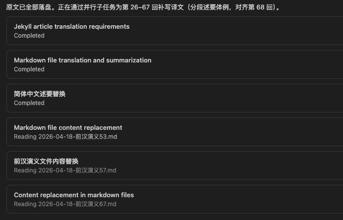

<!-- * 目录
{:toc} -->


<!-- # 引言 -->

前段时间开始读蔡东藩先生的《中国历代通俗演义》，其中《前汉演义》读了差不多半年了，读到第68回的时候，突然奇想，与其每次遇到不懂的文言文查询，不如试试AI一键获取会怎么样呢？因此采用Cursor的Auto模式开始进行批量生成。
当然由于内容过多，目前生成的效果还来不及二次校验（只校验了一小部分），但后续会继续阅读时会一直校验，先以本博文记录下AI生成及目录。

# 书籍目录及索引

* [第一   回：移花接木计献美姬 用李代桃欢承淫后](https://kwanwaipang.github.io/前汉演义01/)
* [第二   回：诛假父纳言迎母 称皇帝立法愚民](https://kwanwaipang.github.io/前汉演义02/)
* [第三   回：封泰岱下山避雨 过湘江中渡惊风](https://kwanwaipang.github.io/前汉演义03/)
* [第四   回：误椎击逃生遇异士 见图谶遣将造长城](https://kwanwaipang.github.io/前汉演义04/)
* [第五   回：信佞臣尽毁诗书 筑阿房大兴土木](https://kwanwaipang.github.io/前汉演义05/)
* [第六   回：坑深谷诸儒毙命 得原璧暴主惊心](https://kwanwaipang.github.io/前汉演义06/)
* [第七   回：寻生路徐巿垦荒 从逆谋李斯矫诏](https://kwanwaipang.github.io/前汉演义07/)
* [第八   回：葬始皇骊山成巨冢 戮宗室豻狱构奇冤](https://kwanwaipang.github.io/前汉演义08/)
* [第九   回：充屯长中途施诡计 杀将尉大泽揭叛旗](https://kwanwaipang.github.io/前汉演义09/)
* [第十   回：违谏议陈胜称王 善招抚武臣独立](https://kwanwaipang.github.io/前汉演义10/)
* [第十一 回：降真龙光韬泗水 斩大蛇夜走丰乡](https://kwanwaipang.github.io/前汉演义11/)
* [第十二 回：戕县令刘邦发迹 杀郡守项梁举兵](https://kwanwaipang.github.io/前汉演义12/)
* [第十三 回：说燕将厮卒救王 入赵宫叛臣弑主](https://kwanwaipang.github.io/前汉演义13/)
* [第十四 回：失兵机陈王毙命 免子祸婴母垂言](https://kwanwaipang.github.io/前汉演义14/)
* [第十五 回：从范增访立楚王孙 信赵高冤杀李丞相](https://kwanwaipang.github.io/前汉演义15/)
* [第十六 回：驻定陶项梁败死 屯安阳宋义丧生](https://kwanwaipang.github.io/前汉演义16/)
* [第十七 回：破釜沈舟奋身杀敌 损兵折将畏罪乞降](https://kwanwaipang.github.io/前汉演义17/)
* [第十八 回：智郦生献谋取要邑 愚胡亥遇弑毙斋宫](https://kwanwaipang.github.io/前汉演义18/)
* [第十九 回：诛逆阉难延秦祚 坑降卒直入函关](https://kwanwaipang.github.io/前汉演义19/)
* [第二十 回：宴鸿门张樊保驾 焚秦宫关陕成墟](https://kwanwaipang.github.io/前汉演义20/)
* [第二十一回：烧栈道张良定谋 筑郊坛韩信拜将](https://kwanwaipang.github.io/前汉演义21/)
* [第二十二回：用秘计暗渡陈仓 受密嘱阴弑义帝](https://kwanwaipang.github.io/前汉演义22/)
* [第二十三回：下河南陈平走谒 过洛阳董老献谋](https://kwanwaipang.github.io/前汉演义23/)
* [第二十四回：脱楚厄幸遇戚姬 知汉兴拼死陵母](https://kwanwaipang.github.io/前汉演义24/)
* [第二十五回：木罂渡军计擒魏豹 背水列阵诱斩陈余](https://kwanwaipang.github.io/前汉演义25/)
* [第二十六回：随何传命招英布 张良借箸驳郦生](https://kwanwaipang.github.io/前汉演义26/)
* [第二十七回：纵反间范增致毙 甘替死纪信被焚](https://kwanwaipang.github.io/前汉演义27/)
* [第二十八回：入内帐潜夺将军印 救全城幸得舍人儿](https://kwanwaipang.github.io/前汉演义28/)
* [第二十九回：贪功得祸郦生就烹 数罪陈言汉王中箭](https://kwanwaipang.github.io/前汉演义29/)
* [第三十  回：斩龙且出奇制胜 划鸿沟接眷修和](https://kwanwaipang.github.io/前汉演义30/)
* [第三十一回：大将奇谋鏖兵垓下 美人惨别走死江滨](https://kwanwaipang.github.io/前汉演义31/)
* [第三十二回：即帝位汉主称尊 就驿舍田横自刭](https://kwanwaipang.github.io/前汉演义32/)
* [第三十三回：劝移都娄敬献议 伪出游韩信受擒](https://kwanwaipang.github.io/前汉演义33/)
* [第三十四回：序侯封优待萧丞相 定朝仪功出叔孙通](https://kwanwaipang.github.io/前汉演义34/)
* [第三十五回：谋弑父射死单于 求脱围赂遗番后](https://kwanwaipang.github.io/前汉演义35/)
* [第三十六回：宴深宫奉觞祝父寿 系诏狱拼死白王冤](https://kwanwaipang.github.io/前汉演义36/)
* [第三十七回：议废立周昌争储 讨乱贼陈豨败走](https://kwanwaipang.github.io/前汉演义37/)
* [第三十八回：悍吕后毒计戮功臣 智陆生善言招蛮酋](https://kwanwaipang.github.io/前汉演义38/)
* [第三十九回：讨淮南箭伤御驾 过沛中宴会乡亲](https://kwanwaipang.github.io/前汉演义39/)
* [第四十  回：保储君四皓与宴 留遗嘱高祖升遐](https://kwanwaipang.github.io/前汉演义40/)
* [第四十一回：折雄狐片言杜祸 看人彘少主惊心](https://kwanwaipang.github.io/前汉演义41/)
* [第四十二回：媚公主腼颜拜母 戏太后嫚语求妻](https://kwanwaipang.github.io/前汉演义42/)
* [第四十三回：审食其遇救谢恩人 吕娥姁挟权立少帝](https://kwanwaipang.github.io/前汉演义43/)
* [第四十四回：易幼主诸吕加封 得悍妇两王枉死](https://kwanwaipang.github.io/前汉演义44/)
* [第四十五回：听陆生交欢将相 连齐兵合拒权奸](https://kwanwaipang.github.io/前汉演义45/)
* [第四十六回：夺禁军捕诛诸吕 迎代王废死故君](https://kwanwaipang.github.io/前汉演义46/)
* [第四十七回：两重喜窦后逢兄弟 一纸书文帝服蛮夷](https://kwanwaipang.github.io/前汉演义47/)
* [第四十八回：遭众忌贾谊被迁 正阃仪袁盎强谏](https://kwanwaipang.github.io/前汉演义48/)
* [第四十九回：辟阳侯受椎毙命 淮南王谋反被囚](https://kwanwaipang.github.io/前汉演义49/)
* [第五十  回：中行说叛国降虏庭 缇萦女上书赎父罪](https://kwanwaipang.github.io/前汉演义50/)
* [第五十一回：老郎官犯颜救魏尚 贤丞相当面劾邓通](https://kwanwaipang.github.io/前汉演义51/)
* [第五十二回：争棋局吴太子亡身 肃军营周亚夫守法](https://kwanwaipang.github.io/前汉演义52/)
* [第五十三回：呕心血气死申屠嘉 主首谋变起吴王濞](https://kwanwaipang.github.io/前汉演义53/)
* [第五十四回：信袁盎诡谋斩御史 遇赵涉依议出奇兵](https://kwanwaipang.github.io/前汉演义54/)
* [第五十五回：平叛军太尉建功 保孱王邻封乞命](https://kwanwaipang.github.io/前汉演义55/)
* [第五十六回：王美人有缘终作后 栗太子被废复蒙冤](https://kwanwaipang.github.io/前汉演义56/)
* [第五十七回：索罪犯曲全介弟 赐肉食戏弄条侯](https://kwanwaipang.github.io/前汉演义57/)
* [第五十八回：嗣帝祚董生进三策 应主召申公陈两言](https://kwanwaipang.github.io/前汉演义58/)
* [第五十九回：迎母姊亲驰御驾 访公主喜遇歌姬](https://kwanwaipang.github.io/前汉演义59/)
* [第六十  回：因祸为福仲卿得官 寓正于谐东方善辩](https://kwanwaipang.github.io/前汉演义60/)
* [第六十一回：挑嫠女即席弹琴 别娇妻入都献赋](https://kwanwaipang.github.io/前汉演义61/)
* [第六十二回：厌夫贫下堂致悔 开敌衅出塞无功](https://kwanwaipang.github.io/前汉演义62/)
* [第六十三回：执国法王恢受诛 骂座客灌夫得罪](https://kwanwaipang.github.io/前汉演义63/)
* [第六十四回：遭鬼祟田蚡毙命 抚夷人司马扬镳](https://kwanwaipang.github.io/前汉演义64/)
* [第六十五回：窦太主好淫甘屈膝 公孙弘变节善承颜](https://kwanwaipang.github.io/前汉演义65/)
* [第六十六回：飞将军射石惊奇 愚主父受金拒谏](https://kwanwaipang.github.io/前汉演义66/)
* [第六十七回：失俭德故人烛隐 庆凯旋大将承恩](https://kwanwaipang.github.io/前汉演义67/)
* [第六十八回：舅甥踵起一战封侯，父子败谋九重讨罪](https://kwanwaipang.github.io/前汉演义68/)
* [第六十九回：勘叛案重兴大狱 立战功还挈同胞](https://kwanwaipang.github.io/前汉演义69/)
* [第七十  回：贤汲黯直谏救人 老李广失途刎首](https://kwanwaipang.github.io/前汉演义70/)
* [第七十一回：报私仇射毙李敢 发诈谋致死张汤](https://kwanwaipang.github.io/前汉演义71/)
* [第七十二回：通西域复灭南夷 进神马兼迎宝鼎](https://kwanwaipang.github.io/前汉演义72/)
* [第七十三回：信方士连番被惑 行封禅妄想求仙](https://kwanwaipang.github.io/前汉演义73/)
* [第七十四回：东征西讨绝域穷兵 先败后成贰师得马](https://kwanwaipang.github.io/前汉演义74/)
* [第七十五回：入虏庭苏武抗节 出朔漠李陵败降](https://kwanwaipang.github.io/前汉演义75/)
* [第七十六回：巫盅狱丞相灭门 泉鸠里储君毙命](https://kwanwaipang.github.io/前汉演义76/)
* [第七十七回：悔前愆痛下轮台诏 授顾命嘱遵负扆图](https://kwanwaipang.github.io/前汉演义77/)
* [第七十八回：六龄幼女竟主中宫 廿载使臣重还故国](https://kwanwaipang.github.io/前汉演义78/)
* [第七十九回：识诈书终惩逆党 效刺客得毙番王](https://kwanwaipang.github.io/前汉演义79/)
* [第八十  回：迎外藩新主入都 废昏君太后登殿](https://kwanwaipang.github.io/前汉演义80/)
* [第八十一回：谒祖庙骖乘生嫌 嘱女医入宫进毒](https://kwanwaipang.github.io/前汉演义81/)
* [第八十二回：孝妇伸冤于公造福 淫妪失德霍氏横行](https://kwanwaipang.github.io/前汉演义82/)
* [第八十三回：泄逆谋杀尽后族 矫君命歼厥渠魁](https://kwanwaipang.github.io/前汉演义83/)
* [第八十四回：询宫婢才识酬恩 擢循吏迭闻报绩](https://kwanwaipang.github.io/前汉演义84/)
* [第八十五回：两疏见机辞官归里 三书迭奏罢兵屯田](https://kwanwaipang.github.io/前汉演义85/)
* [第八十六回：逞淫谋番妇构衅 识子祸严母知几](https://kwanwaipang.github.io/前汉演义86/)
* [第八十七回：杰阁图形名标麟史 锦车出使功让蛾眉](https://kwanwaipang.github.io/前汉演义87/)
* [第八十八回：宠阉竖屈死萧望之 惑谗言再贬周少傅](https://kwanwaipang.github.io/前汉演义88/)
* [第八十九回：冯婕妤挺身当猛兽 朱子元仗义救良朋](https://kwanwaipang.github.io/前汉演义89/)
* [第九十  回：斩郅支陈汤立奇功 嫁匈奴王嫱留遗恨](https://kwanwaipang.github.io/前汉演义90/)
* [第九十一回：赖直谏太子得承基 宠正宫词臣同抗议](https://kwanwaipang.github.io/前汉演义91/)
* [第九十二回：识番情指日解围 违妇言上书惹祸](https://kwanwaipang.github.io/前汉演义92/)
* [第九十三回：惩诸舅推恩赦罪 嬖二美夺嫡宣淫](https://kwanwaipang.github.io/前汉演义93/)
* [第九十四回：智班伯借图进谏 猛朱云折槛留旌](https://kwanwaipang.github.io/前汉演义94/)
* [第九十五回：泄机谋鸩死许后 争座位怒斥中官](https://kwanwaipang.github.io/前汉演义95/)
* [第九十六回：忤重闱师丹遭贬 害故妃史立售奸](https://kwanwaipang.github.io/前汉演义96/)
* [第九十七回：莽朱博附势反亡身 美董贤阖家同邀宠](https://kwanwaipang.github.io/前汉演义97/)
* [第九十八回：良相遭囚呕血致毙 幸臣失势与妇并戕](https://kwanwaipang.github.io/前汉演义98/)
* [第九十九回：献白雉罔上居功 惊赤血杀儿构狱](https://kwanwaipang.github.io/前汉演义99/)
* [第一百  回：窃国权王莽弑帝 投御玺元后覆宗](https://kwanwaipang.github.io/前汉演义100/)


# 代码生成过程

整体流程：**维基文库 API 拉 HTML → BeautifulSoup 取回目与正文段 → `zhconv` 转简体 → 写入 Jekyll Markdown**；`# 译文` 占位符后续由 Cursor 中 AI（可拆多批/子智能体）按第 68 回式述要补全。

## 环境与依赖

在仓库根目录执行（示例为 Python 3.9+）：

```bash
pip install zhconv beautifulsoup4 lxml
```

说明：

* **zhconv**：繁体转大陆简体（`zh-cn`）。
* **beautifulsoup4 + lxml**：解析 `action=parse` 返回的 HTML。
* 请求维基 API 时必须带 **非空 `User-Agent`**（脚本中已写固定标识），否则易被 403。

## 脚本位置与用法

仓库内脚本路径：`scripts/fetch_qianhan_chapters.py`。

```bash
# 默认仅拉第 26～67 回（与早期批处理一致，避免误覆盖全书）
python3 scripts/fetch_qianhan_chapters.py

# 指定区间（示例：全书 1～100 回；会覆盖已存在的同名 md）
python3 scripts/fetch_qianhan_chapters.py --start 1 --end 100

# 仅补某一回
python3 scripts/fetch_qianhan_chapters.py --start 69 --end 69
```

写入路径：`_posts/前汉演义/2026-04-18-前汉演义XX.md`（`XX` 为两位回次）。**再次运行会整文件覆盖**，若已手写译文请先备份或改脚本逻辑。

## 完整脚本

```python
#!/usr/bin/env python3
# -*- coding: utf-8 -*-
"""Fetch 前漢演義 chapters from zh.wikisource.org, convert to zh-cn, write Jekyll posts."""

from __future__ import annotations

import argparse
import json
import re
import sys
import time
import urllib.parse
import urllib.request
from pathlib import Path
from typing import List, Optional, Tuple

from bs4 import BeautifulSoup
import zhconv

UA = "KwanWaiPangBlogBot/1.0 (https://github.com/KwanWaiPang/kwanwaipang.github.io; zhconv+read-only)"

ROOT = Path(__file__).resolve().parents[1]
OUT_DIR = ROOT / "_posts" / "前汉演义"


def api_parse(page: str) -> str:
    q = urllib.parse.urlencode(
        {"action": "parse", "page": page, "prop": "text", "format": "json"}
    )
    url = f"https://zh.wikisource.org/w/api.php?{q}"
    req = urllib.request.Request(url, headers={"User-Agent": UA})
    with urllib.request.urlopen(req, timeout=60) as resp:
        data = json.loads(resp.read().decode("utf-8"))
    if "error" in data:
        raise RuntimeError(data["error"])
    return data["parse"]["text"]["*"]


def _parse_nav_subtitle(nav_text: str) -> Optional[str]:
    """从导航块文字解析副标题；维基文库各回版式略有出入。"""
    flat = re.sub(r"\s+", " ", nav_text.replace("\n", " "))
    patterns = [
        r"前漢演義\s*(第.+?回)\s*(.+?)\s*作者",
        r"前漢演義\s*(第.+?回)\s*(.+?)(?=\s*[◄►])",
        r"前漢演義\s*(第.+?回)\s*(.+?)(?=\s*→|\s*←)",
        r"前漢演義\s*(第.+?回)\s*(.+?)(?=\s*姊妹计划)",
    ]
    for pat in patterns:
        m = re.search(pat, flat)
        if m:
            return m.group(2).strip()
    return None


def extract_title_and_paragraphs(html: str) -> Tuple[str, List[str]]:
    soup = BeautifulSoup(html, "lxml")
    po = soup.select_one(".mw-parser-output")
    if not po:
        raise RuntimeError("no .mw-parser-output")

    subtitle = ""
    paragraphs: List[str] = []

    for child in po.children:
        name = getattr(child, "name", None)
        if not name:
            continue
        if name in ("div", "table") and not subtitle:
            nav_text = child.get_text(" ", strip=True)
            if "前漢演義" in nav_text and "回" in nav_text:
                sub = _parse_nav_subtitle(nav_text)
                if sub:
                    subtitle = sub
            continue
        if name == "p":
            t = child.get_text()
            if not t or not t.strip():
                continue
            paragraphs.append(t.strip())

    if not subtitle:
        blob = po.get_text(" ", strip=True)[:1200]
        subtitle = _parse_nav_subtitle(blob) or ""

    if not subtitle:
        raise RuntimeError("subtitle not found")

    return subtitle, paragraphs


def to_cn(s: str) -> str:
    return zhconv.convert(s, "zh-cn")


def cn_num(n: int) -> str:
    """阿拉伯数字转中文数字（用于 Jekyll title 中的回次，1–100）。"""
    digits = "零一二三四五六七八九"
    if n < 10:
        return digits[n]
    if n == 10:
        return "十"
    if n < 20:
        return "十" + digits[n - 10]
    if n < 100:
        tens, ones = divmod(n, 10)
        return digits[tens] + "十" + (digits[ones] if ones else "")
    if n == 100:
        return "一百"
    return str(n)


def build_markdown(chapter: int, subtitle_tw: str, paras_tw: List[str]) -> str:
    subtitle = to_cn(subtitle_tw)
    body_lines = []
    for p in paras_tw:
        body_lines.append(to_cn(p))
    body = "\n\n".join("　　" + ln.replace("\n", "") for ln in body_lines)

    title = f'读书笔记之——《前汉演义》第{cn_num(chapter)}回：{subtitle}'
    wikilink = f"https://zh.wikisource.org/wiki/%E5%89%8D%E6%BC%A2%E6%BC%94%E7%BE%A9/%E7%AC%AC{chapter:03d}%E5%9B%9E"

    return f"""---
layout: post
title: "{title}"
date: 2026-04-18
tags: [Books]
comments: true
author: kwanwaipang
# toc: false
excerpt: ""
---

<!-- * 参考资料：[蔡东藩《前汉演义》](https://zh.wikisource.org/wiki/%E5%89%8D%E6%BC%A2%E6%BC%94%E7%BE%A9) · [维基文库：本回全文]({wikilink}) -->


---

# 原文

{body}

---

# 译文

（译文生成中）
"""


def main(argv=None) -> None:
    p = argparse.ArgumentParser(description="Fetch 前漢演義 chapters from zh.wikisource.org")
    p.add_argument(
        "--start",
        type=int,
        default=26,
        help="起始回次（含）。默认 26 与历史批处理一致；全书请用 1",
    )
    p.add_argument(
        "--end",
        type=int,
        default=67,
        help="结束回次（含）。默认 67；全书至 100 请写 100",
    )
    args = p.parse_args(argv)
    start, end = args.start, args.end
    if start > end:
        print("error: --start must be <= --end", file=sys.stderr)
        sys.exit(1)

    OUT_DIR.mkdir(parents=True, exist_ok=True)
    for n in range(start, end + 1):
        page = f"前漢演義/第{n:03d}回"
        print("fetch", page)
        html = api_parse(page)
        sub, paras = extract_title_and_paragraphs(html)
        md = build_markdown(n, sub, paras)
        path = OUT_DIR / f"2026-04-18-前汉演义{n:02d}.md"
        path.write_text(md, encoding="utf-8")
        time.sleep(0.35)


if __name__ == "__main__":
    main()

```

## 抓取逻辑摘要

| 步骤 | 说明 |
|------|------|
| API | `https://zh.wikisource.org/w/api.php?action=parse&page=前漢演義/第NNN回&prop=text&format=json` |
| 回目副题 | 从 `.mw-parser-output` 首块 `div` 或 `table` 导航文字中正则提取；部分回次无「作者」字样时换用 `◄►` 等分隔模式；仍失败则在前 1200 字内再扫 |
| 正文 | 收集导航块之后所有顶层 `<p>`，段首统一加全角空格 `　　` |
| 简体 | 副题与正文均经 `zhconv.convert(..., "zh-cn")` |
| 节流 | 每回 `sleep(0.35)`，减轻对维基服务器压力 |

## 译文部分（AI）

脚本生成的 `# 译文` 初值为 `（译文生成中）`。实际生产时在 Cursor 用 Auto / Agent，按回次分批撰写白话述要（对齐 `_posts/前汉演义/2026-04-18-前汉演义68.md`：开篇说明、若干 `##`、诗联要点、`## 回末史论（白话）`），再写回对应 md。**与抓取脚本解耦**，避免一次对话超长。

## 多智能体（可选）

大批量回次时，可在 Cursor 中并行派发多个子任务，各负责一段回次区间，分别改文件。示意截图仍如下（界面随版本可能略有差异）：

<div align="center">
  
<figcaption>Cursor 中并行任务示意</figcaption>
</div>


# 前汉演义梳理

以下按**演义叙事顺序**，就蔡东藩先生所著《前汉演义》一百回中的大关节做较细摘记（叙事顺序不等于严格断代史分期）。回次与站内各篇副题一致，可对照上文「书籍目录及索引」逐回打开。

## 全书鸟瞰

蔡东藩先生此书自战国末年宫闱权谋与秦王政身世写起，经秦一天下、苛役酷法、焚书坑儒与始皇身后政变，转入大泽乡首事、刘项并起；楚汉数载，鸿门、还定三秦、井陉潍水直至垓下；汉高定鼎后迁都与擒韩信、白登忍辱，惠吕之际人彘惨祸与诸吕专权，周勃陈平迎文帝；文景清静与贾谊痛哭，七国乱起而周亚夫细柳一军定之；武皇更化开边、通西域、伐匈奴，酷吏与方士并行，至巫蛊祸作、轮台罪己、托孤霍光；昭宣中兴而霍氏终覆，元成以降石显弄权、王氏渐炽，宫闱夺嫡与外戚宦官交缠，终以哀平之际佞幸董贤、王莽伪谦篡弑、孝元皇后掷玺，西汉名实俱亡。**秦—楚汉—高惠文景—武宣—元成哀平—新莽**构成全书主轴。

<div class="mermaid" style="overflow-x: auto; width: 100%; max-width: 100%; padding: 0.5em 0;">
graph LR
    %% 定义全局样式类
    classDef default fill:#fff,stroke:#333,stroke-width:1px,color:#000,rx:2,ry:2;
    Z[1～8战国秦并] --> Q[9～19秦政民变]
    Q --> C[20～32楚汉汉立]
    C --> H[33～46汉初吕氏]
    H --> W[47～77文景武宣]
    W --> X[78～95元成外戚]
    X --> M[96～100王莽代汉]
</div>

## 战国尾声与秦帝国（第1～8回）

* **第1～2回**：吕不韦献姬、以李代桃之计；秦王政诛假父嫪毐、迎母归咸阳；兼并六国、称皇帝、废封建行郡县，立法愚民之端。
* **第3～4回**：封禅泰岱、渡湘遇风等巡狩气象；张良博浪误中副车、圯上遇黄石公；卢生图谶、遣将筑长城，隐伏亡秦之谶。
* **第5～6回**：卢生等佞臣、焚诗书；阿房大兴土木；坑儒咸阳谷、诸儒毙命；和氏璧（传国玺）入秦，暴主惊心。
* **第7～8回**：徐巿（徐福）求仙垦荒；沙丘之变，李斯、赵高矫诏；始皇葬骊山巨冢；二世戮宗室、严刑豻狱。

<div class="mermaid" style="overflow-x: auto; width: 100%; max-width: 100%; padding: 0.5em 0;">
graph LR
    %% 定义全局样式类
    classDef default fill:#fff,stroke:#333,stroke-width:1px,color:#000,rx:2,ry:2;
    A[吕不韦进姬立嗣] --> B[并六国称皇帝]
    B --> C[封禅长城焚书坑儒]
    C --> D[徐福求仙沙丘矫诏]
    D --> E[葬骊山二世酷法]
</div>

## 秦末起义与秦亡（第9～19回）

* **第9～10回**：陈胜、吴广屯大泽，杀将尉揭竿；陈胜称王、违谏骄败；武臣等略地独立。
* **第11～12回**：刘邦斩蛇、起于丰沛；项梁杀会稽守起兵，项羽从之；楚地豪杰蜂起。
* **第13～14回**：厮卒救燕王、赵宫变弑主；章邯等反扑，陈胜失机毙命；王陵母勉子附汉等节义侧写。
* **第15～16回**：范增说立楚怀王孙心为义帝；赵高诬杀李斯；定陶项梁兵败身亡；宋义屯安阳夺帅权。
* **第17～18回**：项羽破釜沉舟、巨鹿大破秦军；郦食其说齐旁邑；赵高逼弑二世胡亥于斋宫。
* **第19回**：子婴诛赵高；刘邦入关受降；项羽坑秦降卒二十万，入关之势已成。

<div class="mermaid" style="overflow-x: auto; width: 100%; max-width: 100%; padding: 0.5em 0;">
graph LR
    classDef default fill:#fff,stroke:#333,stroke-width:1px,color:#000,rx:2,ry:2;
    A[大泽乡陈胜吴广] --> B[刘项起兵怀王]
    B --> C[巨鹿项羽破秦]
    C --> D[赵高弑二世]
    D --> E[子婴诛高降刘]
    E --> F[项羽坑卒入关]
</div>

## 楚汉争霸与汉朝肇建（第20～32回）

* **第20回**：鸿门宴，项庄舞剑，张良、樊哙翼蔽刘邦；项羽入咸阳焚秦宫，关陕为墟。
* **第21～22回**：张良烧栈道以懈项羽；韩信拜大将；明修栈道、暗渡陈仓，还定三秦；项羽阴弑义帝，楚汉名分愈裂。
* **第23～24回**：陈平渡河投汉；董公说义帝之丧以争名分；刘邦脱楚厄、遇戚夫人；王陵母死节明汉兴之兆。
* **第25～26回**：木罂渡军擒魏豹；井陉背水阵破赵、斩陈余；随何说英布归汉；张良借箸驳郦生分封之议。
* **第27～28回**：陈平反间，范增疽发背亡；纪信替死焚身；韩信被夺将军印；城危急时赖舍人儿献策。
* **第29～30回**：郦生说齐反被烹；刘邦数罪项羽、广武涧中箭；潍水斩龙且；鸿沟议和、接眷为质。
* **第31～32回**：九里山垓下重围，霸王别姬，乌江自刎；刘邦即皇帝位；田横五百士守义自刭等余波。

<div class="mermaid" style="overflow-x: auto; width: 100%; max-width: 100%; padding: 0.5em 0;">
graph LR
    classDef default fill:#fff,stroke:#333,stroke-width:1px,color:#000,rx:2,ry:2;
    A[陈胜首事] --> B[刘项并起]
    B --> C[巨鹿秦军溃]
    C --> D[刘邦入关]
    D --> E[鸿门楚汉对峙]
    E --> F[韩信定北方]
    F --> G[垓下楚灭]
    G --> H[刘邦称帝]
</div>

## 高帝惠吕：制度、匈奴与宫闱惨祸（第33～46回）

* **第33～34回**：娄敬（刘敬）说迁都关中；伪游云梦擒韩信；萧何序功、叔孙通定朝仪，君臣礼法粗立。
* **第35～36回**：匈奴冒顿弑父自强；白登之围，陈平秘计赂阏氏；赵王张敖狱系贯高白冤，高祖晚年猜忌益甚。
* **第37～38回**：周昌廷争易储；陈豨谋反被讨；吕后诱杀韩信、醢彭越；陆贾使南越，赵佗称臣。
* **第39～40回**：亲征淮南英布，高祖中箭；过沛置酒大风歌；四皓保太子；高祖遗嘱崩逝。
* **第41～42回**：戚夫人被做人彘，惠帝惊心；审食其、张辟疆等在吕氏羽翼下浮沉；惠帝以嫚语戏太后，母子愈乖。
* **第43～44回**：审食其遇救；吕后立少帝、诸吕封王；赵王友饿死、燕王建忧死，刘氏宗室岌岌可危。
* **第45～46回**：陆贾调停将相；齐王起兵声讨诸吕；周勃入北军、陈平定策，诛吕氏；迎代王刘恒，废杀吕所立少帝。

<div class="mermaid" style="overflow-x: auto; width: 100%; max-width: 100%; padding: 0.5em 0;">
graph LR
    classDef default fill:#fff,stroke:#333,stroke-width:1px,color:#000,rx:2,ry:2;
    A[迁都关中伪游擒信] --> B[白登和亲贯高狱]
    B --> C[韩信彭越见诛]
    C --> D[人彘惠吕乖离]
    D --> E[诸吕封王宗室危]
    E --> F[诛吕迎文帝]
</div>

## 文景清静与七国之乱（第47～56回）

* **第47～48回**：文帝即位，窦后兄弟重逢；一纸书服南越，和亲匈奴；贾谊上策遭忌被迁长沙；袁盎谏正阃仪。
* **第49～50回**：淮南王刘长椎杀辟阳侯；后谋反被囚；中行说降匈奴为边患之引；缇萦上书，文帝除肉刑。
* **第51～52回**：冯唐谏赦魏尚；申屠嘉面劾邓通；吴太子争棋局被杀，吴楚怨隙深种；周亚夫细柳营肃军。
* **第53～55回**：晁错削地，申屠嘉呕血；吴王濞倡七国之乱；袁盎、赵涉等献计；太尉周亚夫坚壁断粮，平叛功成。
* **第56回**：王美人得幸、栗太子被废，储位之争再启，为武帝朝立端。

<div class="mermaid" style="overflow-x: auto; width: 100%; max-width: 100%; padding: 0.5em 0;">
graph LR
    classDef default fill:#fff,stroke:#333,stroke-width:1px,color:#000,rx:2,ry:2;
    A[文帝即位匈奴南越] --> B[贾谊痛哭袁盎礼]
    B --> C[吴楚怨隙棋局]
    C --> D[晁错削地七国反]
    D --> E[周亚夫细柳平叛]
    E --> F[栗太子废储位摇]
</div>

## 武帝初年：更化、开边与酷吏初兴（第57～67回）

* **第57～58回**：景帝崩，武帝即位；董仲舒天人三策；申公两言；卫子夫由歌女入宫。
* **第59～60回**：武帝亲迎母王太后、姊平阳公主；东方朔以谐谏得官，寓正于谐。
* **第61～62回**：司马相如琴挑卓文君、献赋入朝；马邑之谋诱单于不成，王恢下吏自杀，汉匈和战转折。
* **第63～64回**：灌夫骂座得罪；田蚡骄横，疑「鬼祟」而死；司马相如通西南夷，开边衅。
* **第65～66回**：窦太主、陈皇后骄淫失势；公孙弘曲学阿世；李广射石没镞；主父偃推恩、受金拒谏终败。
* **第67回**：卫青、霍去病屡出朔方大捷，舅甥封侯；武帝厚赏将士。

<div class="mermaid" style="overflow-x: auto; width: 100%; max-width: 100%; padding: 0.5em 0;">
graph LR
    classDef default fill:#fff,stroke:#333,stroke-width:1px,color:#000,rx:2,ry:2;
    A[即位董申更化] --> B[卫子夫东方谏]
    B --> C[相如献赋开西南]
    C --> D[马邑谋泄王恢死]
    D --> E[灌夫田蚡狱死]
    E --> F[推恩弘汤偃败]
    F --> G[卫霍朔方大捷]
</div>

## 武帝中晚期：功业、方士与巫蛊（第68～77回）

* **第68回**：卫青尚平阳公主，恩宠愈专；漠南之役霍去病八百骑深入立功，封冠军侯；朝廷鬻武功爵、获白麟改元元狩；淮南王刘安、衡山王刘赐逆谋渐露。
* **第69回**：淮南、衡山两狱勘治，张汤主谳，株连极广；刘据立为皇太子；张骞再使西域；霍去病祁连、焉支大捷，李广以寡敌众脱围，霍仲孺、霍光等线索并出。
* **第70～71回**：汲黯直谏活人无数；李广难封、失道引刀自刭；霍去病射杀李敢；张汤舞文弄法，终被三长史逼死。
* **第72～74回**：张骞之后通西域，南夷置郡；天马、宝鼎诸瑞；封禅泰山、屡求神仙；贰师李广利远征大宛得失马。
* **第75回**：苏武牧羊北海十九年全节；李陵降匈奴，司马迁受腐刑，忠叛与史笔并写。
* **第76～77回**：巫蛊起，丞相公孙贺族灭；卫太子据泉鸠里兵败自尽；武帝悔悟下轮台诏；托孤霍光、金日磾等，画《负扆图》嘱后事。

<div class="mermaid" style="overflow-x: auto; width: 100%; max-width: 100%; padding: 0.5em 0;">
graph LR
    classDef default fill:#fff,stroke:#333,stroke-width:1px,color:#000,rx:2,ry:2;
    A[卫霍功高淮南狱起] --> B[立太子据张骞西行]
    B --> C[祁连焉支贰师马]
    C --> D[苏武李陵史迁刑]
    D --> E[巫蛊丞相族灭]
    E --> F[太子泉鸠兵败]
    F --> G[轮台罪己托孤光]
</div>

## 昭宣中兴与霍氏之覆（第78～83回）

* **第78回**：昭帝幼冲，上官氏幼女为后；苏武还汉，十九年使节荣归。
* **第79～80回**：燕王旦等诈书谋反伏诛；霍光废昌邑王刘贺，迎立宣帝刘询于民间。
* **第81～82回**：霍光女为宣帝后，骖乘之嫌；许皇后被霍氏女医毒弑；于公治狱，东海孝妇雪冤；霍氏权倾内外。
* **第83回**：霍氏谋反事泄，族诛；上官桀等党羽尽夷，权归皇室。

<div class="mermaid" style="overflow-x: auto; width: 100%; max-width: 100%; padding: 0.5em 0;">
graph LR
    classDef default fill:#fff,stroke:#333,stroke-width:1px,color:#000,rx:2,ry:2;
    A[昭帝幼冲上官后] --> B[苏武持节归汉]
    B --> C[燕王旦诈书伏诛]
    C --> D[霍光废贺立宣帝]
    D --> E[许后见毒霍氏炽]
    E --> F[霍禹谋反族诛]
</div>

## 元成之世：儒生、宦官与王氏坐大（第84～95回）

* **第84～85回**：宣帝询宫婢知报恩、擢循吏；疏广、疏受知足辞官；赵充国三书屯田罢兵，羌事渐平。
* **第86～87回**：乌孙公主解忧、冯嫽锦车持节；麒麟阁图像功臣；女使功不让须眉。
* **第88～89回**：元帝信宦官，萧望之被迫自杀；周堪、张猛再贬；冯婕妤当熊护驾；朱云折槛直谏留旌。
* **第90～92回**：陈汤矫诏斩郅支单于；王昭君出塞和亲；元帝崩，太子得立；谷永等识番情解围，亦有上书贾祸者。
* **第93～95回**：以「推恩」等名目惩抑诸舅、赦罪弭衅，而外戚之势难回；赵飞燕、赵合德姊妹夺嫡宣淫；许皇后被鸩、班婕妤见机退处；王氏同日五侯封，王根、王莽等柄国日深。

<div class="mermaid" style="overflow-x: auto; width: 100%; max-width: 100%; padding: 0.5em 0;">
graph LR
    classDef default fill:#fff,stroke:#333,stroke-width:1px,color:#000,rx:2,ry:2;
    A[宣帝吏治麒麟阁] --> B[赵充国屯田罢兵]
    B --> C[冯嫽解忧通西域]
    C --> D[元帝石显杀望之]
    D --> E[陈汤斩郅支昭君出塞]
    E --> F[飞燕合德夺嫡]
    F --> G[王氏五侯莽根深]
</div>

## 哀平之际与王莽代汉（第96～100回）

* **第96～97回**：师丹议限田、忤太后遭贬；史立等构陷故妃傅氏；王莽、朱博相互攀附又反目殒身；董贤男色邀宠，阖门富贵。
* **第98～99回**：王莽囚迫丞相王嘉致死；董贤失势与妇并诛；王莽献白雉、造作符瑞，诛异己、杀其子以立威。
* **第100回**：王莽弑平帝、立孺子婴，居摄践祚；最终逼宫夺玺，孝元皇后掷玺于地，汉家宗庙名存实亡，蔡东藩先生于此收束西汉演义。

<div class="mermaid" style="overflow-x: auto; width: 100%; max-width: 100%; padding: 0.5em 0;">
graph LR
    classDef default fill:#fff,stroke:#333,stroke-width:1px,color:#000,rx:2,ry:2;
    A[师丹限田史立构陷] --> B[朱博附莽旋败亡]
    B --> C[董贤男色极富贵]
    C --> D[莽杀王嘉威大臣]
    D --> E[白雉符命诛异己]
    E --> F[弑平帝立孺子婴]
    F --> G[逼宫夺玺元后掷玺]
</div>


---


