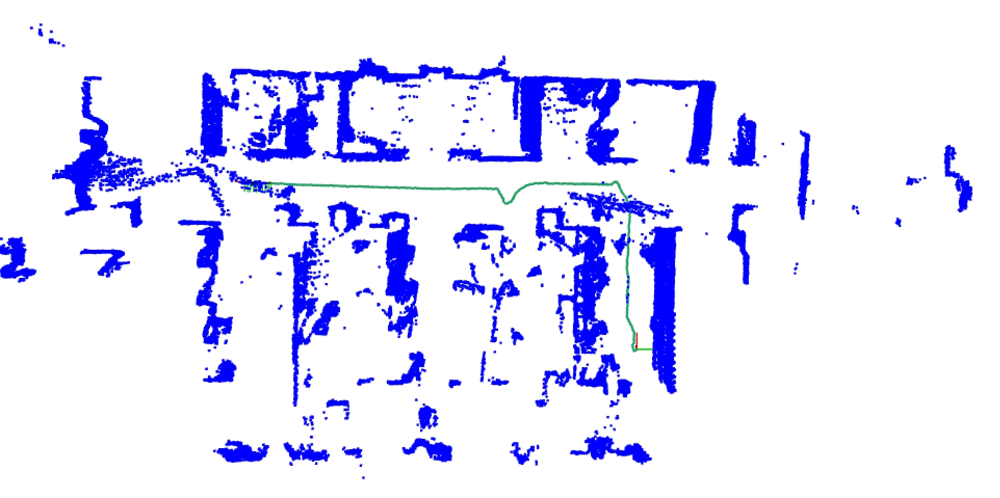
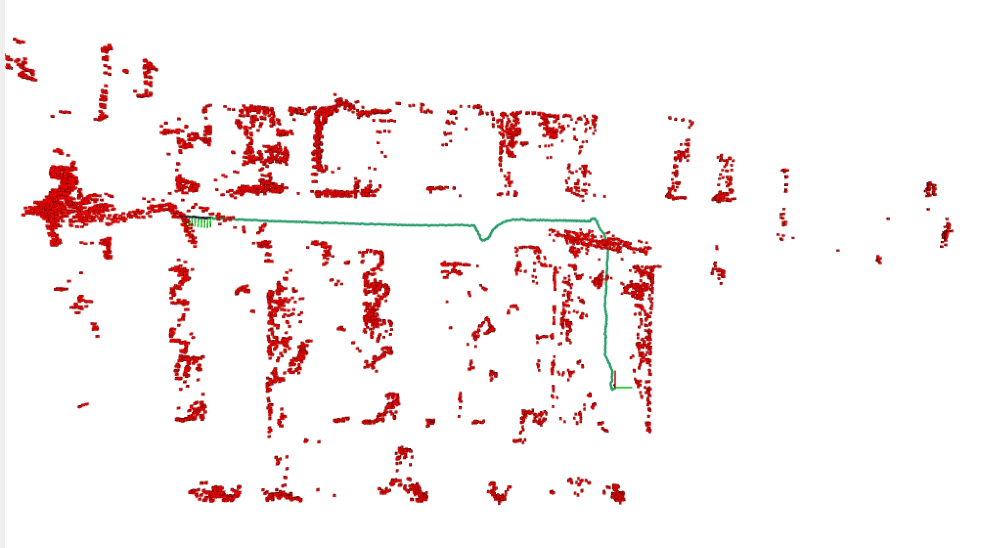
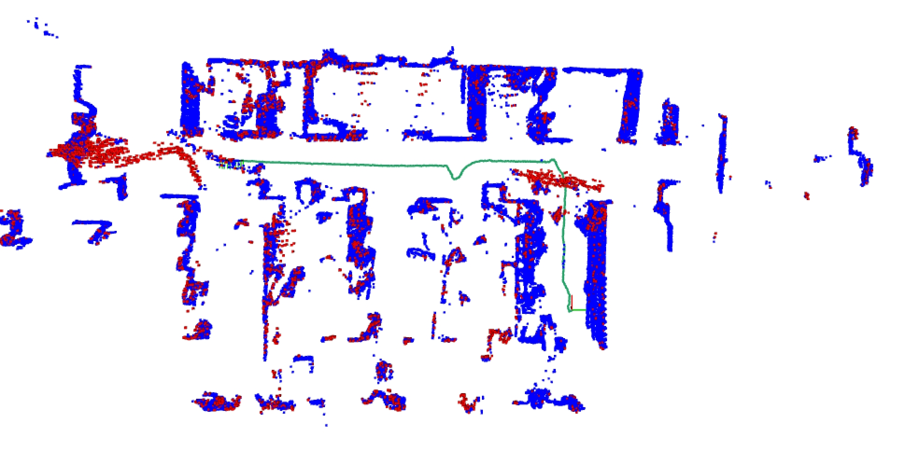

<!-- * 目录
{:toc} -->

* 本博文复现过程采用的代码及代码注释（如有）：[My github repository](https://github.com/R-C-Group/btsa_test)
* [PDF](https://arxiv.org/pdf/2510.22313v1)
* 原github：[Link](https://github.com/arclab-hku/btsa)


# 原理解读

## 1. 问题与动机

经典 LIO 普遍隐含**静态环境假设**：把环境当作不变背景做配准；当行人、车辆等运动物体出现在视场内时，ICP 等配准算法容易把**动态元素误当作固定参考点**，从而在**位姿估计与建图**上引入显著误差。这一问题在两类情形会**尤其严重**：一是环境中**动态物体占主导**，二是环境中**静态几何特征有限**，难以提供足够稳定的背景约束。
常见做法是「先分割/剔除动态，再做里程计」，但这会陷入一种**鸡生蛋式的循环依赖**：要准确定位需要可靠的静态点，而要可靠地区分动静态又往往依赖已经准确的位姿。

本文的核心思路是：**不把动态检测当作配准前的独立预处理**，而是把**时空法向（spatio-temporal normal）分析嵌进 ICP 的迭代闭环**里，使每一轮迭代同时更新「哪些点可信」与「位姿是多少」，从而在实时条件下弱化上述循环依赖。

所以本质上本文不能算是动态物体检测，应该是不可靠的点的滤除。
所谓的`unstable points`包含了动态以及不可靠的观测点。
* 动态点：相对背景有相对运动 → 局部时空拟合里时间维明显有差异
* 不可靠点：新视野、时间邻域不均匀、扫描模式变化等

## 2. 时空表示与法向的物理含义

将世界系下的点记为 $\mathbf{p}_i^j$，采集时刻为 $t^j$，构造**四维时空点** $\tilde{\mathbf{p}}_i^j = (\mathbf{p}_i^j, t^j)$。设想时空中存在隐式曲面 $g(x,y,z,t)=0$，其梯度 $\nabla g = (a,b,c,d)^\top$ 即为该点处的**时空法向** $\tilde{\mathbf{n}}=(a,b,c,d)$：$(a,b,c)$ 对应空间方向，$d$ 对应时间维分量。

对沿该曲面运动的点，对 $g=0$ 求全导数可得约束 $a v_x + b v_y + c v_z + d = 0$，即

$
d = -(a v_x + b v_y + c v_z).
$


直观理解：**$d$ 编码了「空间梯度与瞬时速度」之间的耦合**；对理想静态背景，局部邻域在时空上对齐后 $d$ 应接近 0；对相对背景有明显相对运动的点，局部拟合出的超平面会在时间维上「翘起」，从而 $$|d|$$ 变大。文中图 2 用 2D+时间示意：瞬时速度（切向）与时空法向（法向）的几何关系。


## 3. 时空法向如何估计

对每个点 $\mathbf{p}_i^j$，在其邻域 $\mathcal{N}_i^j$ 内收集**来自滑动时间窗内多帧**的邻居点，每个邻居带上各自时间戳，组成向量 $[\mathbf{p}_u^v;\, t_u^v]$。以邻域质心 $\mathbf{m}_i^j$ 为中心构造 $4\times 4$ 协方差矩阵（论文式 (2)），其**最小特征值对应的特征向量**即作为该点的时空法向 $\tilde{\mathbf{n}}$ 的估计——等价于在局部用 PCA 拟合一张**时空切超平面**，法向取最薄（方差最小）的方向。

需要注意：在线场景下邻域在时间上未必均匀，**新观测区域**或**扫描模式突变**也会在拟合中产生非零的「表观运动」，从而把部分静态点误判为动态。作者因此不把「不稳定点」仅等同于语义上的动态物体，而是把**真动态点**与**配准上不可靠的点**一并称为 **unstable points**（后文建图阶段会专门处理假阳性）。

* `we categorize both truly dynamic and unreliable points as “unstable points`


## 4. 动态感知配准：嵌入 ICP 的动静态判别

整体仍采用 IEKF 框架估计 IMU-LiDAR 状态 $\mathbf{x}^j$（位姿、速度、偏置等），与 FAST-LIO2 类似先做 IMU 预积分与点云去畸变，并体素下采样。关键在 LiDAR 更新：**动态感知 ICP** 在算法 1 的循环中反复执行：

1. 用当前位姿估计将当前帧变换到世界系；
2. 基于**时间滑动窗地图** $M_t$ 计算各点时空法向 $\tilde{\mathbf{n}}$；
3. 用 $|d|$ 与阈值 $d_{\mathrm{thr}}$ 划分 **stable / unstable**，**只用 stable 点**与全局地图配准；
4. 最小化 IMU 残差 + 点到平面残差更新状态，直至收敛；
5. 用最终位姿更新 $M_t$ 与长期体素地图 $M_v$。

也就是说：**动静态标签不是一次算死，而是随 ICP 迭代与位姿修正反复重算**，实现「检测—配准」在同一优化过程里耦合。

### 双地图结构 $M_t$ 与 $M_v$

- **时间滑动窗地图 $M_t$**：保留约 **2 秒**内的近期点云（iKdTree + 双端队列），时间上足够密，便于对每个点做时空邻域与法向估计。
- **长期体素地图 $M_v$**：采用 VoxelMap 式平面体素表示，提供**空间上更丰富**的全局参考，用于稳定位姿。

二者分工兼顾：**时间邻近**支撑时空法向；**空间覆盖**支撑全局一致配准。

### 阈值 $d_{\mathrm{thr}}$ 的可解释选取

作者不用纯调参口吻，而是用时空法向与其**空间投影** $(a,b,c,0)$ 的夹角 $\theta$ 刻画「时间维偏离」程度，并有 $\cos\theta$ 与 $d$、$\lVert \tilde{\mathbf{n}} \rVert$ 的闭式关系。文中举例：$\theta_{\mathrm{thr}}=5.7^\circ$ 时对应 $|d|\approx 0.1$，便于把阈值与「可感知的微小运动」联系起来（开源 README 中也提到 $|d|>0.1$ 作为不稳定判据量级）。

## 5. 静态建图：基于空间一致性的假阳性剔除

仅用 $|d|$ 判动态会引入两类**假阳性**（论文图 4(a)）：新暴露区域首次进入地图；相邻帧间扫描模式变化导致局部几何不一致。它们并非真实运动，却可能呈现非零 $d$。

**空间一致性检验**利用一条经验规律：**真动态点往往成簇**；孤立噪声点更像误检。流程概要：

1. 对体素下采样后的 **unstable** 点做上采样/近邻扩展，找回邻域内可能同属一类的点；
2. **DBSCAN** 聚类，去除孤立小噪点；
3. 对每个簇求包围盒，过大的簇丢弃；
4. 维护轻量**短期静态滑动体素图** $M_{\mathrm{scc}}$，记录传感器附近近期判为静态的区域；
5. 计算候选动态簇与 $M_{\mathrm{scc}}$ 的**体积重叠**：真实运动物体与已建静态结构重叠小；新观测静态区域与已有静态记录重叠大，从而被纠正。

该步骤主要服务**静态地图更干净**，与前面「定位用 stable 点」形成互补。

## 6. 小结：与相关路线的差异

| 方面 | 常见动态 LIO | 本文 BTSA |
|------|----------------|-----------|
| 动态处理与配准 | 多为先检测再配准，或依赖较强先验/学习类别 | 在 **ICP 迭代内**用时空法向联合筛点与估姿 |
| 时空法向相关先行工作 | 多用于**位姿已知后**的建图后处理，或依赖未来帧 | **当前帧、当前迭代**内与状态估计耦合 |
| 地图 | 单一种全局表示 | **短时窗 $M_t$**（法向）+ **长期 $M_v$**（配准） |

若只记一句话：**把点在 $(x,y,z,t)$ 里的局部几何与运动线索压进一个四维法向里，并让它参与每次 ICP 的数据关联，从而在动态占优或静态几何结构有限时仍尽量用「真静态」约束去拉住位姿；建图端再用空间一致性收拾假阳性。**


# 复现及实验记录


## 安装过程

```bash
# 安装livox
cd ~/catkin_ws/src
git clone https://github.com/Livox-SDK/livox_ros_driver.git
cd ..
catkin build livox_ros_driver

# 安装btsa
cd ~/catkin_ws/src
git clone git@github.com:R-C-Group/btsa_test.git
cd ..
# catkin clean btsa
catkin build btsa
source devel/setup.bash

# 其他依赖安装
sudo apt-get install libgoogle-glog-dev
# 但系统自动安装的可能有问题，修复了“CMakeLists.txt”
``` 


* 运行：
  
```bash
source devel/setup.bash
roslaunch btsa dynamic.launch

# 速腾激光雷达
roslaunch btsa robosense.launch 
```

## 实验结果

* 一开始跑作者给的rosbag出现没有Log文件的报错，但我提交的代码已经修复了，红色点为不稳定点云（动态点），蓝色点云为静态点。
* 基于速腾激光雷达（添加了速腾激光雷达的点云处理），测试效果如下：

<div align="center">
  <table style="border: none; background-color: transparent;">
    <tr align="center">
      <td style="width: 50%; border: none; padding: 0.01; background-color: transparent; vertical-align: middle;">
        
        静态地图点
      </td>
      <td style="width: 50%; border: none; padding: 0.01; background-color: transparent; vertical-align: middle;">
        
        动态地图点
      </td>
    </tr>
  </table>
  <figcaption>
  </figcaption>
</div>

<div align="center">
  
<figcaption> 
完整地图 
</figcaption>
</div>

* `/cloud_unstable`:理解成「被判为动态/不稳定」的点云,所谓的动态点云应该说是打分超过阈值的点
* `/cloud_static`：当前帧里、去掉动态邻域扩张后的静态那一半扫描


# 其他

* [Dynablox: Real-time Detection of Diverse Dynamic Objects in Complex Environments](https://arxiv.org/pdf/2304.10049), [Github](https://github.com/ethz-asl/dynablox)