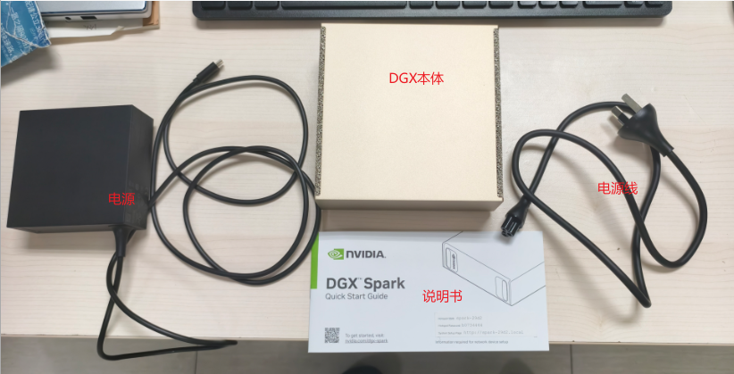
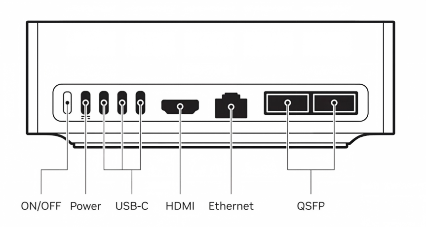
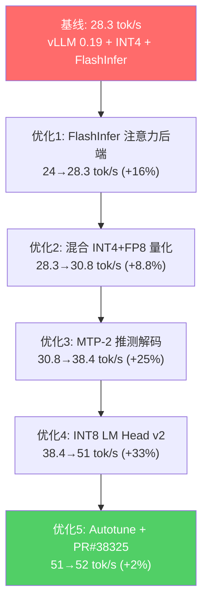
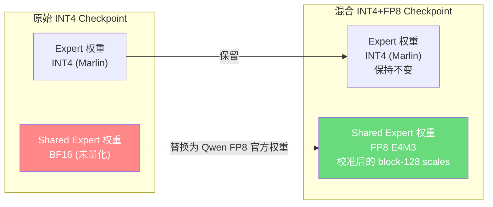
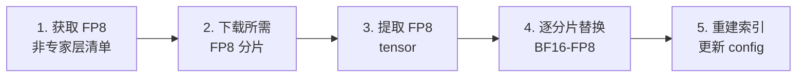
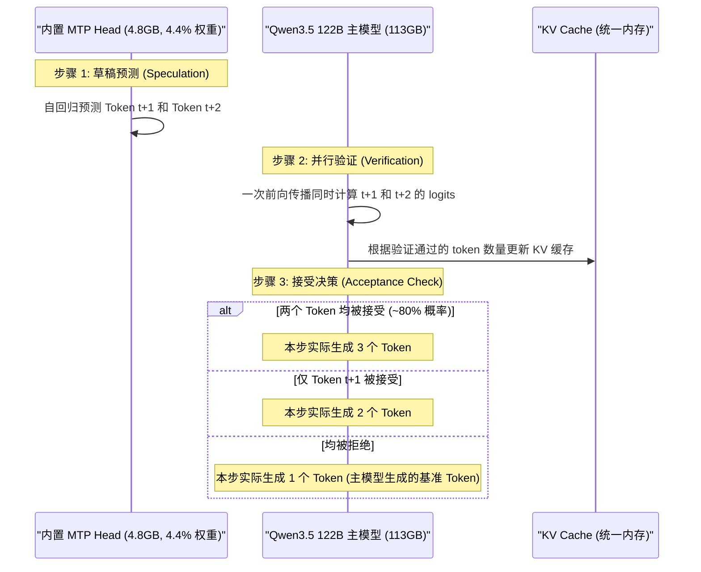
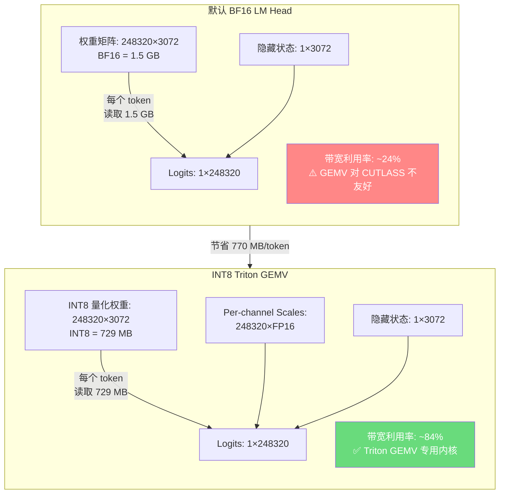
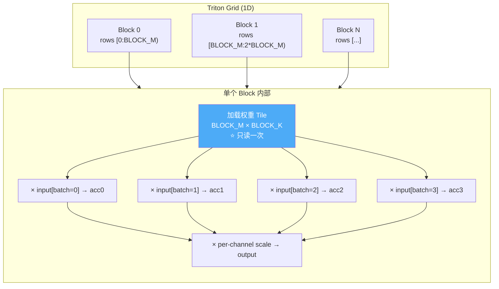
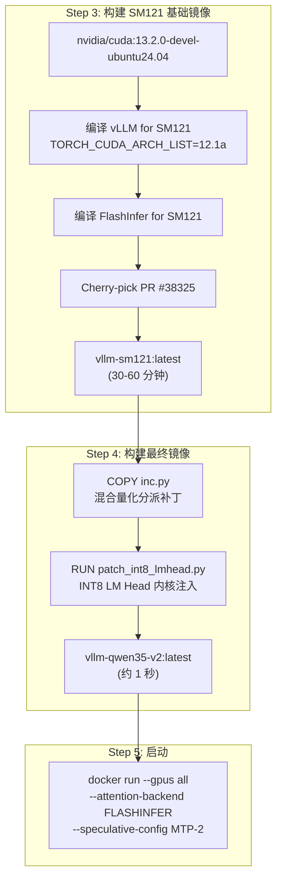

<!-- * 目录
{:toc} -->


# 引言

大语言模型（LLM）的本地化部署正成为越来越多场景的刚需——无论是数据隐私、离线推理还是定制化开发。然而，像 Qwen3.5-122B 这样参数量高达 1220 亿的 MoE 模型，对硬件平台提出了极高要求。

本文记录了在 **NVIDIA DGX Spark** 这一桌面级 AI 工作站上，从零开始部署 **Qwen3.5-122B-A10B** 模型的完整过程。更关键的是，通过参考开源项目并引入一系列模型加速优化手段，将推理速度从基线的 **15.44 tok/s（NVFP4）提升至 46.88 tok/s（hybrid-int4fp8）**，实现了显著的性能增益，且无质量损失。

本文将从以下四个方面展开：
1. NVIDIA DGX Spark 的硬件介绍与基本配置
2. Qwen3.5 122B-A10B 的安装部署过程
3. 模型加速优化的技术原理（含源码分析）
4. 效率测试与对比

---

# 一、NVIDIA DGX Spark 硬件介绍与配置

## 1.1 DGX Spark 简介

NVIDIA DGX Spark™ 是一款桌面级 AI 超级计算机，在小巧的桌面形态下提供 **1 PFLOP** AI 算力与 **128 GB 统一内存**，可本地运行高达 200B 参数模型推理并微调 70B 参数模型。双设备互联更可支持 405B 参数模型。

> [!NOTE]
> 除了本地单机运行外，NVIDIA DGX Spark 的一大核心物理特性是其内建的高速通信接口支持多机/多设备高速分布式计算。借助 ConnectX 网络和 QSFP56 高速光接口（通信带宽达 **200Gbps**），用户可以通过双机或多机互联实现统一内存和计算资源的池化，从而进一步支持高达 405B 参数的超大模型推理与微调，打破单机物理容量上限。
> 
> 国内甚至有销售渠道提供四台 Spark 互联组网的解决方案，宣称可以本地运行 671B（如 [链接]()）等超大模型。这在硬件架构上完全可行：英伟达在 GTC 2026 大会上已正式宣布 DGX Spark 支持四节点集群（提供 512GB 统一内存与 4 PFLOPS 算力），能够承载最高 700B 参数级的企业级大模型（参见 [链接](https://developer.nvidia.cn/build-spark/multi-sparks-through-switch)）。
> 
> 这种高效的跨机分布式通信，核心取决于每台 Spark 原生集成的 **ConnectX-7 200Gbps 网卡**与 **QSFP56 接口**，并在软件上支持 GPUDirect RDMA（绕过 CPU 直接传输 GPU 数据）和 NCCL 的深度优化。相比之下，普通消费级工作站（例如双卡 Thor 设备）由于缺乏 Mellanox 专属高速网卡与物理 NVLink 接口，其多节点网络互联仅能使用 **10Gbps** 或更低的普通以太网口。在跨机张量并行同步时，这将带来极高的通信延迟瓶颈，因此在实际工程中，几乎没有人会使用 Thor 来做多机分布式计算。

其核心规格如下：

| 参数                  | 规格                                                     |
| --------------------- | -------------------------------------------------------- |
| **超级芯片**          | NVIDIA GB10 Grace Blackwell                              |
| **GPU 架构**          | Blackwell（SM121）                                       |
| **CPU**               | 20 核 ARM Grace CPU（aarch64）                           |
| **统一内存**          | 128 GB（LPDDR5x）                                        |
| **统一内存/显存带宽** | 273 GB/s                                                 |
| **AI 算力**           | 1 PFLOP                                                  |
| **CUDA 版本**         | 13.0                                                     |
| **网络/通信带宽**     | ConnectX + WiFi 7 + QSFP56 200Gbps (支持双机/多设备互联) |
| **操作系统**          | Ubuntu 24.04 LTS                                         |

## 1.2 开箱与基本配置

DGX Spark 包含如下配件：
- 1 台 DGX Spark 主机
- 交流电源线
- 1 个带 USB-C 插头的直流电源
- 快速入门指南手册

<div align="center">

</div>

接口布局如下图所示，注意**电源只能插在最左侧 Type-C 口（Power）**。QSFP56 接口为四通道小型可插拔光模块接口，总传输速率可达 200Gbps。

<div align="center">

</div>

## 1.3 首次启动、初始设置与硬件信息查看

首次启动与系统适配流程如下：

1. **系统启动**：连接显示器后，DGX Spark 自动加载首次配置向导。
2. **语言和时区**：语言选择 **English**（防止中文不兼容），时区选择 **ASIA Shanghai**。
3. **键盘布局和条款**：默认配置跳过。
4. **用户创建**：设置用户名和密码。
5. **WIFI 连接**：连接网络后，系统会自动下载并安装完整的软件镜像（此过程请勿中断，系统可能重启多次）。
6. **登录与硬件验证**：登录系统后，可以通过 `nvidia-smi` 查看显卡驱动和 GPU 运行信息（驱动已默认预装，CUDA 版本为 13.0，GPU 架构为 Blackwell SM121，配备 128 GB 统一内存）。

<div align="center">

</div>

---

# 二、Qwen3.5 122B-A10B 安装部署

在进行推理环境搭建与部署前，请确保系统已安装 Conda 环境（例如推荐使用 Miniforge3 以适配 aarch64 架构）。后续的 vLLM 及虚拟环境依赖包管理都将基于 Conda 展开。

## 2.1 Docker 环境设置

在 DGX Spark 上进行开发推荐使用 Docker，可以最大限度保持底层系统的稳定与纯净。DGX Spark **已默认预装 Docker 及 NVIDIA Container Toolkit**，开箱即用。

### 用户组设置

默认执行 Docker 命令需要 `sudo` 权限，通过以下命令修改权限：

```bash
sudo usermod -aG docker $USER
newgrp docker
```

### Docker 镜像源配置（国内网络）

```bash
sudo mkdir -p /etc/docker
sudo tee /etc/docker/daemon.json <<-'EOF'
{
    "registry-mirrors": [
        "https://docker.1ms.run",
        "https://docker.xuanyuan.me",
        "https://docker.m.daocloud.io"
    ]
}
EOF

sudo systemctl restart docker
```

## 2.2 vLLM 环境安装

vLLM 是目前主流的 LLM 推理引擎，支持 PagedAttention、连续批处理等技术。安装有两种方式：

### 方式一：Docker 拉取（推荐）

```bash
docker pull vllm/vllm-openai:nightly
```

> 注意：Docker 镜像大小约 19.6 GB。

### 方式二：虚拟环境编译安装

```bash
# 拉取最新的 vllm 仓库
git clone --recursive https://github.com/vllm-project/vllm.git

# 创建虚拟环境
conda create -n vllm python=3.10.12
conda activate vllm

# 安装 torch 等依赖
pip install torch==2.11.0 torchvision==0.26.0 torchaudio==2.11.0 \
    --index-url https://download.pytorch.org/whl/cu130

# 设置使用当前 pytorch
python3 use_existing_torch.py

# 编译安装（耗时较长，请耐心等待）
pip install --no-build-isolation -e .
```

## 2.3 模型下载与切分

### 下载 NVFP4 模型权重

从 [Hugging Face](https://huggingface.co/Sehyo/Qwen3.5-122B-A10B-NVFP4) 下载 Qwen3.5-122B-A10B NVFP4 模型权重。

### 模型切分

由于原始下载的模型分片文件较大（单个最高 50GB），直接加载会导致显存瞬间激增引发 OOM。需要对模型进行切分：

```bash
cd /home/grgbot/xieweiyang/codes_Qwen/
# 注意修改脚本内部的模型路径
python split_llm_model.py
```

## 2.4 启动推理服务

### 进入 Docker 镜像环境

```bash
docker run -it --name vllm-qwen35 \
    --gpus all --net=host --ipc=host \
    -v /home/grgbot/models:/models \
    --entrypoint /bin/bash \
    vllm-qwen35-v2
```

### 启动推理服务

进入 Docker 容器后，执行：

```bash
vllm serve /models/qwen35-122b-hybrid-int4fp8 \
    --served-model-name qwen \
    --port 8004 \
    --max-model-len 32768 \
    --gpu-memory-utilization 0.65 \
    --reasoning-parser qwen3 \
    --attention-backend FLASHINFER \
    --speculative-config '{"method":"mtp","num_speculative_tokens":2}'
```

看到如下输出即表示启动成功：

```
(APIServer pid=662) INFO:     Application startup complete.
```

### 测试服务

```bash
# curl http://localhost:8000/v1/chat/completions \
#   -H "Content-Type: application/json" \
#   -d '{
#     "model": "/app/models/Sehyo--Qwen3.5-122B-A10B-NVFP4-split",
#     "messages": [{"role": "user", "content": "请给出辣椒炒蛋的步骤"}],
#     "max_tokens": 100,
#     "temperature": 0,
#     "chat_template_kwargs": {"enable_thinking": false}
#   }'
curl -X POST 10.1.50.7:8004/v1/chat/completions -H "Content-Type: application/json" -d '{"model":"qwen","messages":[{"role":"user","content":"输出一个字"}],"chat_template_kwargs":{"enable_thinking":false}}'
```

---

# 三、模型加速优化——技术原理分析

在基线配置（vLLM 0.19 + AutoRound INT4 + FlashInfer）下，Qwen3.5-122B-A10B 在 DGX Spark 上的推理速度为 **28.3 tok/s**。通过参考开源加速项目 [DGX_Spark_Qwen3.5-122B-A10B-AR-INT4](https://github.com/albond/DGX_Spark_Qwen3.5-122B-A10B-AR-INT4) 引入混合 INT4+FP8 量化、MTP-2 推测解码与 Triton INT8 LM Head v2 等级联优化，最终在本地测得 **46.88 tok/s** 的生成速度，相比基线提升了 **+65.6%**（详见第四节测试结果）。

本节对该项目中所使用的核心加速技术进行深入的原理剖析与源码解读。

下面是各项优化的叠加效果总览（数据源自参考项目在标准基准下的测试）：

| 配置                                                | tok/s    | 相对基线提升 |
| --------------------------------------------------- | -------- | ------------ |
| Baseline（vLLM 0.19 + AutoRound INT4 + FlashInfer） | **28.3** | —            |
| + Hybrid INT4+FP8 Dense Layers                      | **30.8** | +8.8%        |
| + MTP-2 Speculative Decoding                        | **38.4** | +35.7%       |
| + INT8 LM Head v2                                   | **51**   | +80%         |
| + @triton.autotune + PR #38325 swapAB（v2.4）       | **52**   | **+82%**     |

## 整体加速流程概览



下面逐一分析每项优化的技术原理和源码实现。

---

## 3.1 优化一：FlashInfer 注意力后端

**效果：24.0 → 28.3 tok/s（+16%）**

vLLM 默认在 SM121 上使用 `FLASH_ATTN` 后端。FlashInfer 针对 Blackwell 架构的内存层级做了专门优化，只需一个参数即可获得 16% 的性能提升：

```bash
--attention-backend FLASHINFER
```

这是"零成本"的优化——无需修改模型权重，无需额外编译，仅切换注意力计算后端。

---

## 3.2 优化二：混合 INT4+FP8 量化（Hybrid Quantization）

**效果：28.3 → 30.8 tok/s（+8.8%）**

### 核心思路

Qwen3.5-122B-A10B 是 MoE（Mixture of Experts）架构。MoE 层中有两类权重：

- **专家权重（Expert Weights）**：256 个稀疏专家，每次推理只激活部分专家
- **共享专家权重（Shared Expert）**：每次推理都参与计算的密集层

混合量化的思路是：
- **MoE 专家权重**保持 INT4 量化（Marlin 内核，0.5 bytes/param）
- **共享专家的密集层权重**替换为 FP8（1 byte/param，使用 SM121 原生 CUTLASS FP8 block-128 内核）



### 核心设计考量

#### 1. 为什么混合量化比纯 INT4 基线更快？
在自回归解码（Decode）阶段，对于纯 INT4 权重，GPU 的 Tensor Cores 无法直接对其进行矩阵乘法计算，必须在运行时首先调用反量化（De-quantization）算子，将 4-bit 权重还原为 FP16/BF16，然后再与激活值做矩阵乘法。这引入了额外的反量化计算开销和寄存器压力。

而 NVIDIA DGX Spark 搭载的 Blackwell 架构（SM121）具有**原生 FP8 Tensor Cores 硬件加速**，能够直接执行 FP8 矩阵乘法，**完全省去了运行时的反量化开销**。将每次推理都会 100% 激活的共享专家密集层（Shared Expert）和注意力映射层替换为 FP8，可以直接借助 SM121 原生的 CUTLASS FP8 算子进行极速计算。因此，其执行速度比存在反量化瓶颈的纯 INT4 Marlin 内核更快，速度从 28.3 tok/s 提升到 30.8 tok/s，提升了 **8.8%**。

#### 2. 既然 FP8 硬件加速更快，为什么不全用 FP8？
这完全受限于 DGX Spark 的**显存容量瓶颈**（128 GB 统一内存的物理天花板）。
* **全用 FP8 的显存灾难**：Qwen3.5-122B-A10B 参数量高达 1220 亿，如果全部使用 FP8 量化（1 字节/参数），单是模型权重就要占用近 **122 GB** 显存。这会导致 128 GB 的统一内存在加载完模型后仅剩 6 GB 左右的空间，根本无法分配 vLLM 运行所必须的 KV Cache（键值缓存），导致推理时瞬间发生 OOM（显存溢出）。
* **混合量化的“甜点区”**：256 个 MoE 专家权重极其庞大，用 **INT4** Marlin 格式量化（0.5 字节/参数）能够最大限度缩减体积；而常驻计算的密集层则采用 **FP8** 原生计算。混合量化后的模型权重仅占约 **84 GB** 显存，能为 vLLM 留出高达 **44 GB** 的富余显存来存放 KV Cache。

因此，**“INT4 缩减体积保显存，FP8 原生计算提速度”** 的混合量化方案，是在 128GB 内存限制下部署 122B 级 MoE 模型的最佳平衡解。

### 源码分析：Checkpoint 构建流程

混合 checkpoint 的构建逻辑在 [build-hybrid-checkpoint.py](https://github.com/albond/DGX_Spark_Qwen3.5-122B-A10B-AR-INT4/blob/master/patches/01-hybrid-int4-fp8/build-hybrid-checkpoint.py) 中，整个流程分 5 步完成：



**步骤 1：获取 FP8 非专家层清单** — 通过读取 FP8 checkpoint 的 `model.safetensors.index.json`，过滤出不含 `.experts.` 的权重（即密集层权重）：

```python
def get_fp8_non_expert_manifest(fp8_repo: str) -> dict[str, str]:
    idx_path = hf_hub_download(fp8_repo, "model.safetensors.index.json")
    with open(idx_path, encoding="utf-8") as f:
        idx = json.load(f)
    wm = idx["weight_map"]
    # 关键：过滤掉 .experts. 的权重，只保留密集层
    return {k: v for k, v in wm.items() if ".experts." not in k}
```

**步骤 4：逐分片替换** — 遍历 GPTQ checkpoint 的每个 safetensors 分片，对匹配的密集层权重进行替换，同时添加对应的 FP8 scale tensor（`weight_scale_inv`）：

```python
for name, tensor in gptq_tensors.items():
    if name in fp8_tensors:
        fp8_tensor = fp8_tensors[name]
        # 校验形状一致性
        if tensor.shape != fp8_tensor.shape:
            raise ValueError(f"Shape mismatch for {name}")
        # 计算节省的空间（BF16 2bytes -> FP8 1byte）
        old_bytes = tensor.numel() * tensor.element_size()
        new_bytes = fp8_tensor.numel() * fp8_tensor.element_size()
        total_saved_bytes += old_bytes - new_bytes
        output_tensors[name] = fp8_tensor  # 用 FP8 权重替换
        # 同时添加对应的 scale tensor（FP8 block-128 需要）
        scale_name = name.replace(".weight", ".weight_scale_inv")
        if scale_name in fp8_tensors and scale_name != name:
            output_tensors[scale_name] = fp8_tensors[scale_name]
    else:
        output_tensors[name] = tensor  # 专家权重保持 INT4
```

**步骤 5：重建索引** — 从实际的分片内容重建 `model.safetensors.index.json`，并在 `config.json` 中写入混合量化元信息：

```python
def update_safetensors_index(output_dir: Path) -> None:
    weight_map: dict[str, str] = {}
    for shard_path in find_model_safetensors_files(output_dir):
        with safe_open(str(shard_path), framework="pt") as f:
            for key in f.keys():
                weight_map[key] = shard_path.name
    index = {"metadata": {"total_size": total_size}, "weight_map": weight_map}
```

### 源码分析：vLLM 推理时的混合量化分派（inc.py）

混合量化在推理时需要 vLLM 能自动识别哪些层是 FP8、哪些是 INT4。这通过修改 `inc.py`（Intel Neural Compressor 量化模块）实现。`INCConfig` 类新增了三个关键属性和方法。

**修改 1：FP8 层自动探测（`maybe_update_config`）** — 在模型加载前扫描 safetensors 元数据，识别所有 `float8_e4m3fn` 类型且带有 `weight_scale_inv` 的权重，并自动推断 FP8 block size：

```python
def maybe_update_config(self, model_name: str, revision: str | None = None):
    """Detect FP8 layers in hybrid INT4+FP8 checkpoints."""
    metadata = get_safetensors_params_metadata(model_name, revision=revision)
    fp8_weights: dict[str, dict[str, Any]] = {}
    for param_name, info in metadata.items():
        dtype_str = info.get("dtype", None)
        if dtype_str is None:
            continue
        torch_dtype = _SAFETENSORS_TO_TORCH_DTYPE.get(dtype_str)
        # 检测 FP8 权重：必须同时有对应的 scale tensor
        if torch_dtype == torch.float8_e4m3fn and param_name.endswith(".weight"):
            scale_name = param_name.replace(".weight", ".weight_scale_inv")
            if scale_name in metadata:
                fp8_weights[param_name] = info

    # 从权重和 scale 的形状推断 block size
    # 例如 weight=[3072, 3072], scale=[24, 24] -> block_size=[128, 128]
    for param_name, info in fp8_weights.items():
        scale_name = param_name.replace(".weight", ".weight_scale_inv")
        scale_info = metadata[scale_name]
        w_shape, s_shape = info.get("shape", []), scale_info.get("shape", [])
        if len(w_shape) == 2 and len(s_shape) == 2:
            block_size = [w_shape[0] // s_shape[0], w_shape[1] // s_shape[1]]
            break

    # 创建 Fp8Config 并记录 FP8 层名称集合
    self.fp8_config = Fp8Config(
        is_checkpoint_fp8_serialized=True,
        activation_scheme="dynamic",
        weight_block_size=block_size,
    )
    self.fp8_layers = {name.rsplit(".weight", 1)[0] for name in fp8_weights}
```

**修改 2：FP8 层匹配逻辑（`_is_layer_fp8`）** — 判断一个具体的层是否应使用 FP8。这里还需要处理 vLLM 的"融合模块"（如 `qkv_proj` 是 `q_proj`、`k_proj`、`v_proj` 的融合），通过 `packed_modules_mapping` 展开比较：

```python
def _is_layer_fp8(self, prefix: str) -> bool:
    if not self.fp8_layers:
        return False
    if prefix in self.fp8_layers:
        return True
    # 处理融合模块匹配
    fused_mapping = getattr(self, "packed_modules_mapping", {})
    proj_name = prefix.split(".")[-1]
    if proj_name in fused_mapping:
        shard_prefixes = [
            prefix.replace(proj_name, shard)
            for shard in fused_mapping[proj_name]
        ]
        return all(
            any(fp8_layer in sp for fp8_layer in self.fp8_layers)
            for sp in shard_prefixes
        )
    return any(fp8_layer in prefix for fp8_layer in self.fp8_layers)
```

**修改 3：量化方法分派** — 在 `apply_gptq_quant_layer` 和 `get_quant_method` 两处插入 FP8 分派逻辑。当检测到非量化层（`weight_bits >= 16`）且该层在 FP8 层集合中时，返回 `Fp8LinearMethod` 而非默认的 `UnquantizedLinearMethod`：

```python
    def apply_gptq_quant_layer(self, layer, prefix: str, backend: str = "auto"):
        weight_bits, group_size, sym = self.get_layer_config(layer, prefix)
        if not self.check_quantized(weight_bits):
            # Hybrid INT4+FP8: dispatch FP8 for dense layers
            fp8_match = self._is_layer_fp8(prefix) if self.fp8_config else False
            if "shared_expert" in prefix or "linear_attn" in prefix:
                logger.info(
                    "INC GPTQ dispatch: prefix=%s, bits=%d, fp8_match=%s, "
                    "fp8_config=%s, layer_type=%s",
                    prefix, weight_bits, fp8_match,
                    self.fp8_config is not None,
                    type(layer).__name__,
                )
            if self.fp8_config and fp8_match:
                return Fp8LinearMethod(self.fp8_config)
            if isinstance(layer, (LinearBase, ParallelLMHead)):
                return UnquantizedLinearMethod()
            else:
                return None
```

---

## 3.3 优化三：MTP-2 推测解码（MTP-2 Speculative Decoding）

**效果：30.8 → 38.4 tok/s（+25%）**

### 技术原理

在大语言模型自回归解码（Decode）阶段，每次生成一个 token 都必须将高达千亿参数的权重矩阵从显存（统一内存）中读取一遍。这种机制导致计算单元（Tensor Cores）大部分时间都在等待数据传输，使得推理速度极度受限于内存带宽（Memory Bandwidth Bound）。

**推测解码（Speculative Decoding）**通过引入一个轻量级的草稿（Draft）模型来快速预测后续的数个 token，然后由参数量巨大的主模型（Target Model）在一次前向传播中并行地对这些 token 进行验证。如果预测正确，便可一次性产出多个 token，从而显著减少主模型的内存读取次数，提升生成速度。

Qwen3.5-122B-A10B 原生内置了 **MTP（Multi-Token Prediction，多 token 预测）** 模块。MTP-2 (`num_speculative_tokens:2`) 表示在解码步骤中同时推测未来 2 个 token。本地测试表明，位置 2 的草稿 token 接受率高达约 **80%**。



### 为什么选择内置 MTP 模块而不是其他草稿模型？

在评估推测解码方案时，对比分析了三种不同的推测解码路径：

1. **EAGLE-3 外置草稿模型**：EAGLE 需要下载并加载一个独立的 5GB 左右的草稿模型。这在推理时会引入额外的算子调度和显存交互开销，且需要进行二次对齐，在测试中其虽然有 10% 的提升，但性能和易用性均不及 MTP。
2. **KnapSpec 剪层自推测（Self-Speculative）**：KnapSpec 通过跳过主模型的部分层来作为草稿模型。但由于 Qwen3.5 是 MoE 架构，跳过层前向传播仍然需要读取约 **75%** 的模型权重，导致带宽极度吃紧，在带宽受限的 DGX Spark 上性能反而下降。
3. **MTP Head（内置）**：MTP 权重仅为 **4.8 GB**，仅占主模型权重的约 **4.4%**。在自回归生成草稿 token 时，GPU 只需要读取这 4.4% 的超轻量权重，调度 and 内存带宽开销极小。

| 方案                 | 草稿模型体积                   | 内存读取开销                                   | 评估结果                      |
| -------------------- | ------------------------------ | ---------------------------------------------- | ----------------------------- |
| **EAGLE-3**          | 约 5.0 GB                      | 独立调度与权重读取，存在对齐开销               | 速度提升较弱，配置繁琐        |
| **KnapSpec**         | 无（剪层）                     | 需读取主模型约 75% 的权重，内存饱和            | 带宽瓶颈严重，甚至变慢        |
| **MTP Head（内置）** | **仅 4.8 GB（占主模型 4.4%）** | **内存开销极小，零额外调度成本，无需二次校准** | **最优选，推测速度提升 +25%** |

### 源码实现与注册

Intel AutoRound 分发的 checkpoint 中，MTP 权重文件 `model_extra_tensors.safetensors`（约 4.8GB）是物理存在的，但因为其在 `model.safetensors.index.json` 中**没有被列出**，导致 vLLM 默认发现并无法加载它们。

脚本 [add-mtp-weights.py](https://github.com/albond/DGX_Spark_Qwen3.5-122B-A10B-AR-INT4/blob/master/patches/02-mtp-speculative/add-mtp-weights.py) 通过扫描源 checkpoint 并将 785 个带有 `mtp` 的权重键值映射到 `model_extra_tensors.safetensors`，写回索引 JSON 文件，使得 vLLM 启动时能通过 `--speculative-config` 参数正常识别并调用：

```python
# 注册 MTP 权重映射
target_index = target / "model.safetensors.index.json"
with open(target_index) as f:
    tgt_idx = json.load(f)

for key in mtp_keys:
    tgt_idx["weight_map"][key] = "model_extra_tensors.safetensors"

with open(target_index, "w") as f:
    json.dump(tgt_idx, f, indent=2)
```

---

## 3.4 优化四：INT8 LM Head v2（最关键的优化）

**效果：38.4 → 51 tok/s（+33%）——这是所有优化中增益最大的一项**

### 问题分析

LM Head 是模型的输出层，负责将隐藏状态映射到词表概率。Qwen3.5 的词表大小为 248,320，隐藏维度为 3,072，因此 LM Head 权重矩阵的大小为 `248320 × 3072`，在默认的 BF16 下占用 **1.5 GB** 的显存空间。

在解码阶段（batch=1），每生成一个 token 都要完整读取这个 1.5 GB 的矩阵。这是一个典型的 **GEMV（矩阵-向量乘法）** 操作，属于极度带宽受限的场景。默认的 BF16 matmul 在 GEMV 形状下只能达到约 **24% 的内存带宽利用率**。



### 源码深度分析

INT8 LM Head v2 的核心实现在 [patch_int8_lmhead.py](https://github.com/albond/DGX_Spark_Qwen3.5-122B-A10B-AR-INT4/blob/master/patches/03-int8-lm-head/patch_int8_lmhead.py) 中。它通过文本替换的方式修改 vLLM 的 `logits_processor.py`，注入自定义的 Triton 内核。

#### 第一步：运行时 BF16 → INT8 量化

```python
# 首次推理时进行一次性量化（per-channel）
w = lm_head.weight.data  # shape: [248320, 3072], dtype: BF16
scales = w.float().abs().amax(dim=1) / 127.0  # 每行（每个词表token）一个 scale
scales = scales.clamp(min=1e-12)
w_int8 = (w.float() / scales.unsqueeze(1)).round().clamp(-127, 127).to(torch.int8)

# 保存 INT8 权重和 scales，释放原始 BF16 权重
lm_head._ww_int8 = w_int8       # 729 MB (vs 1.5 GB)
lm_head._ww_scales = scales.to(torch.float16)
lm_head.weight.data = torch.empty(0, ...)  # 释放原始权重
```

这里采用的是 **per-channel 量化**（每行一个 scale），因为 LM Head 的不同行对应不同的词表 token，各行的数值范围差异较大。per-channel 量化能很好地保持 top-k token 排名的一致性，不会降低输出质量。

#### 第二步：Triton GEMV 内核（v2 核心创新）

v1 版本的内核存在一个致命问题：**Python 层面的 for 循环**为 batch 中的每个 token 逐一发射内核，导致多次权重读取。

v2 版本的解决方案是**单次内核发射处理整个 batch**，权重矩阵只读取一次：

```python
@triton.autotune(configs=_AUTOTUNE_CONFIGS, key=['M', 'K', 'NUM_BATCH'])
@triton.jit
def _k_v2(out_ptr, w_ptr, x_ptr, s_ptr, M, K,
          stride_ob, stride_xb, NUM_BATCH: tl.constexpr,
          BLOCK_M: tl.constexpr, BLOCK_K: tl.constexpr):
    pid_m = tl.program_id(0)
    rows = pid_m * BLOCK_M + tl.arange(0, BLOCK_M)
    rmask = rows < M

    # 每个 batch 元素独立的累加器
    acc0 = tl.zeros((BLOCK_M,), dtype=tl.float32)
    acc1 = tl.zeros((BLOCK_M,), dtype=tl.float32)
    acc2 = tl.zeros((BLOCK_M,), dtype=tl.float32)
    acc3 = tl.zeros((BLOCK_M,), dtype=tl.float32)

    for ks in range(0, K, BLOCK_K):
        co = ks + tl.arange(0, BLOCK_K)
        km = co < K
        # ⭐ 关键：权重 tile 只加载一次
        w = tl.load(w_ptr + rows[:, None] * K + co[None, :],
                    mask=rmask[:, None] & km[None, :], other=0).to(tl.float32)
        # 对每个 batch 元素复用同一份权重
        x0 = tl.load(x_ptr + 0 * stride_xb + co, mask=km, other=0.0).to(tl.float32)
        acc0 += tl.sum(w * x0[None, :], axis=1)
        if NUM_BATCH > 1:
            x1 = tl.load(x_ptr + 1 * stride_xb + co, mask=km, other=0.0).to(tl.float32)
            acc1 += tl.sum(w * x1[None, :], axis=1)
        # ... 同理处理 batch 2, 3

    # Scale 还原并输出
    s = tl.load(s_ptr + rows, mask=rmask, other=1.0).to(tl.float32)
    tl.store(out_ptr + 0 * stride_ob + rows, (acc0 * s).to(tl.float16), mask=rmask)
```

其核心设计如下图所示：



关键优化点总结：

| 对比项       | v1             | v2             |
| ------------ | -------------- | -------------- |
| 内核发射次数 | batch_size 次  | **1 次**       |
| 权重读取次数 | batch_size 次  | **1 次**       |
| 带宽利用率   | ~49%           | **~84%**       |
| 预计耗时     | ~11.34 ms/step | **~3 ms/step** |

#### 第三步：@triton.autotune 自动调参

v2.4 版本新增了 `@triton.autotune` 装饰器，让 Triton 在 8 种配置组合中自动选择最优的 `BLOCK_M`、`BLOCK_K`、`num_warps`、`num_stages` 参数：

```python
_AUTOTUNE_CONFIGS = [
    triton.Config({'BLOCK_M': 64,  'BLOCK_K': 256}, num_warps=4, num_stages=3),
    triton.Config({'BLOCK_M': 128, 'BLOCK_K': 128}, num_warps=4, num_stages=3),
    triton.Config({'BLOCK_M': 128, 'BLOCK_K': 256}, num_warps=4, num_stages=2),  # v2 基线
    triton.Config({'BLOCK_M': 128, 'BLOCK_K': 256}, num_warps=4, num_stages=3),
    triton.Config({'BLOCK_M': 128, 'BLOCK_K': 256}, num_warps=8, num_stages=2),
    triton.Config({'BLOCK_M': 128, 'BLOCK_K': 512}, num_warps=8, num_stages=2),
    triton.Config({'BLOCK_M': 256, 'BLOCK_K': 128}, num_warps=8, num_stages=3),
    triton.Config({'BLOCK_M': 256, 'BLOCK_K': 256}, num_warps=8, num_stages=2),
]
```

autotune 的开销是每个唯一的 `(M, K, NUM_BATCH)` 组合约 1.6 秒，首次推理时总开销约 6 秒，之后使用缓存结果。实测带来 **+1.2%** 的额外提升。

---

## 3.5 优化五：vLLM PR #38325 swapAB FP8 GEMM

**效果：+0.76%（累积 +2.0%）**

这是 vLLM 上游的一个 PR，为 SM120 系列添加了 "swapAB" CUTLASS dispatch（B-major weight layout），在 `M ≤ 64 || M % 4 != 0` 的条件下自动激活——这恰好是 `shared_expert` FP8 层在 batch 1-4 时的形状。

该优化通过在构建 vLLM base image 时 cherry-pick PR #38325 的 diff 来应用：

```bash
# 在 spark-vllm-docker 的 Dockerfile 中注入 PR #38325
cp patches/05-pr38325-swapab/pr38325-swapab-fp8-sm120.diff local-pr38325.diff
# 通过 Python 脚本注入到 Dockerfile 的 vLLM 构建阶段
```

---

## 3.6 Docker 镜像构建流程

整个加速方案的最终产物是一个定制的 Docker 镜像 `vllm-qwen35-v2`，其构建过程如下：



最终启动命令：

```bash
docker run -d --name vllm-qwen35 \
    --gpus all --net=host --ipc=host \
    -v ~/models:/models \
    vllm-qwen35-v2 \
    serve /models/qwen35-122b-hybrid-int4fp8 \
    --served-model-name qwen \
    --port 8000 \
    --max-model-len 262144 \
    --gpu-memory-utilization 0.90 \
    --reasoning-parser qwen3 \
    --attention-backend FLASHINFER \
    --speculative-config '{"method":"mtp","num_speculative_tokens":2}'
```

---

## 3.7 其他尝试过但无效的优化

在最终方案确定之前，团队测试了 20+ 种优化方案，以下是一些具有代表性的"失败经验"：

| 方案                       | 结果                  | 原因分析                                    |
| -------------------------- | --------------------- | ------------------------------------------- |
| NVFP4 (RedHatAI)           | -42% 更慢(16.6 tok/s) | SM121 缺少 FP4 CUTLASS 内核支持             |
| EAGLE-3                    | +10% 但不如 MTP       | 需额外草稿模型权重，MTP 更优                |
| SERE 专家重路由            | 0% 提升               | Qwen3.5 的 256 专家过于专业化               |
| AdaptiveSoftmax            | 0% 提升               | 散列内存读取仅 2.5% 带宽利用率              |
| INT8 Shared Expert         | 输出乱码              | 对已校准 FP8 权重的二次量化破坏精度         |
| Triton 原生 SM121 MoE 内核 | 0% 提升               | 瓶颈在内存带宽而非计算                      |
| Prefix Caching             | 结果错误              | DeltaNet 层维护循环状态，与 KV 前缀缓存冲突 |

---

## 3.8 扩展内容：TurboQuant KV Cache 压缩（选读）

在超长上下文（例如 256K 或更高）或高并发服务场景下，KV Cache（键值缓存）会占用大量的显存，甚至超过模型权重本身。为了解决显存瓶颈，项目中引入了 Google 提出的 **TurboQuant (TQ)** 压缩技术。

### 技术原理

TurboQuant 将 KV Cache 的隐藏向量从标准的 BF16（每个元素 2 字节）压缩至 **~3.5 bits**（约 4.27 倍压缩，从 512 字节/位置压缩至 120 字节/位置），其核心包含以下两项压缩机制：

1. **MSE 量化（MSE Quantization）**：
   * 对 KV 向量进行结构化阿达马变换（Structured Hadamard Transform）以均匀分布激活值。
   * 使用劳埃德-麦克斯（Lloyd-Max）质心算法将坐标量化为 2-bit 或 3-bit 索引。针对容易产生偏离的通道（Outlier Dims）使用高精度的 3-bit，常规通道使用 2-bit。
2. **QJL 残差编码（QJL Residual）**：
   * 将量化后的残差通过随机矩阵投影为 1-bit 符号（Sign Projection），从而在不解压的情况下，能够在 GPU 寄存器中直接通过点积公式计算注意力得分。

```
压缩前：512 字节 (BF16)
压缩后 (120 字节 Packed Format)：
  - Outlier Group (128维): 48B MSE索引 + 16B QJL符号 + 4B 范数 = 68 字节
  - Regular Group (128维): 32B MSE索引 + 16B QJL符号 + 4B 范数 = 52 字节
```

### 为什么速度会下降 22%？

使用 TurboQuant 可以获得 **4 倍的 KV 缓存容量**（在单卡上支持的 KV token 缓存从 35.5 万提升至 140 万），但其生成速度会从 51 tok/s 下降至约 39 tok/s（下降 22%）。这主要是由于硬件与软件架构的限制：

1. **Triton 替代 FlashInfer（损失约 15%）**：FlashInfer 注意力后端目前不支持非标准的高级压缩 KV 格式。为了在点积时直接解包并计算 3.5-bit 向量，必须使用自定义的 Triton 注意力内核。而 Triton 生成的代码执行效率通常低于 FlashInfer 的手工优化 CUDA 内核。
2. **分段 CUDA 图（Piecewise CUDA Graphs，损失约 7%）**：Triton TQ 内核在运行时的 JIT 编译行为使得 vLLM 无法将其捕获为单张完整的 CUDA 图（Full CUDA Graph Capture），而必须回退为分段（Piecewise）的 CUDA 图。这增加了 CPU 的算子发射延迟。
3. **计算复杂度增加**：虽然读取的数据量减少为 1/4，但每一次注意力计算时，GPU 寄存器都需要进行大量的位解包（Bit Unpacking）和 Codebook 查表操作。在 DGX Spark 这种以访存带宽为瓶颈的 SM121 硬件上，计算量的激增使得指令吞吐成为了新的瓶颈。

因此，**TurboQuant 是一种“空间换时间”的折中方案**。在并发不高、上下文在 256K 以内的场景下，不推荐使用它；而在超长文本高并发时，它是避免 OOM 的利器。

### TurboQuant 预热配置

```bash
# 生成不同压缩策略的 TQ 元数据（以 TQ35 为例）
python patches/04-turboquant/generate_tq_metadata.py \
    --model-dir ~/models/qwen35-122b-hybrid-int4fp8 \
    --recipe turboquant35 \
    --output-path ~/models/qwen35-122b-hybrid-int4fp8/turboquant_kv_tq35.json
```

---

# 四、效率测试与对比

## 4.1 基线 NVFP4 模型测试指标

在本地 DGX Spark 设备上，使用 `qwen_throughout.py` 脚本对基线的 NVFP4 部署进行了吞吐量测试。测试使用的 Prompt 长度为 15，输出 Token 长度为 281。测试日志输出如下：

```
Current usage: CompletionUsage(completion_tokens=281, prompt_tokens=15, total_tokens=296, completion_tokens_details=None, prompt_tokens_details=None)
Prompt tokens: 15
Completion tokens: 281
Total tokens: 296
total output time:17.94 seconds
Execution time: 19.01 seconds
TTFT: 1064.41 ms
Input tokens per second: 14.09
Output tokens per second: 15.66
Total tokens per second: 15.57

Response:
True
```

各项性能指标代表的含义如下：
* **total output time**：纯输出阶段（Decode 阶段）的生成耗时（秒）。
* **Execution time**：从客户端请求发出到接收到最后一个生成 token 的完整端到端时间（秒）。
* **TTFT (Time To First Token)**：首字延迟，即接收到第一个 token 的时间。
* **Input tokens per second**：每秒钟模型处理 of 输入 token 数量（预填充阶段速度）。
* **Output tokens per second**：每秒钟模型生成输出 token 的数量（解码阶段速度）。
* **Total tokens per second**：总吞吐速率（输入+输出的总 token / 总耗时）。

## 4.2 不同模型精度与配置对比

在本地 DGX Spark 设备（需要 16 分片或 14 分片加载）以及更高规格的双卡 Thor 设备上，针对不同的模型精度 and 部署配置进行了详细的对比测试。本地真实测试指标汇总如下：

| Qwen3.5 模型参数量    | 模型精度                        | 模型分片 | 显存占用   | 处理输入 token 速度 (tokens/s) - 首次 | 处理输入 token 速度 (tokens/s) - 后续 | 首字延迟 (TTFT) - 首次 | 首字延迟 (TTFT) - 后续 | 生成 token 速度 (tokens/s) | 300 token 回复总耗时 |
| --------------------- | ------------------------------- | -------- | ---------- | ------------------------------------- | ------------------------------------- | ---------------------- | ---------------------- | -------------------------- | -------------------- |
| 122B-A10B (Thor)      | NVFP4                           | 2段      | 86G        | 0.27                                  | 23.64                                 | 55.0s                  | 0.60s                  | 9.00                       | 30.0s                |
| 122B-A10B (Spark)     | NVFP4                           | 16段     | 86G        | 1.00 (约)                             | 19.98                                 | 1.15s                  | 0.75s                  | 15.44                      | 17.0s                |
| 122B-A10B (Thor)      | INT4                            | 14段     | 86G        | 19.00                                 | 51.50                                 | 0.70s                  | 0.30s                  | 26.00                      | 11.5s                |
| **122B-A10B (Spark)** | **INT4 基线**                   | 14段     | **84.73G** | 9.51                                  | **62.90**                             | 1.50s                  | **0.238s**             | **28.30**                  | **10.3s**            |
| **122B-A10B (Spark)** | **hybrid-int4fp8 (本优化方案)** | 14段     | **113G**   | 11.00                                 | **53.20**                             | 1.35s                  | **0.280s**             | **46.88**                  | **5.48s**            |

### 核心结论

1. **加速效果显著**：在相同的 **NVIDIA DGX Spark** 设备上，经过混合 FP8 量化、MTP-2 推测解码和 Triton INT8 LM Head 等多重优化后的 `hybrid-int4fp8` 方案，其解码生成速度达到了 **46.88 tokens/s**。相比于 INT4 基线的 **28.30 tokens/s** 提升了 **65.6%**；相比于开箱默认的 NVFP4 部署方案（**15.44 tokens/s**）则更是提升了 **203.6%**！
2. **延迟与耗时的全面缩短**：生成 300 个 token 的完整时间从 17.0 秒（NVFP4）缩短至仅 **5.48 秒**，已经完全能够满足桌面级端侧 AI 助理的实时交互体验。
3. **显存消耗与性能权衡**：`hybrid-int4fp8` 将密集层恢复为了 FP8 精度，使得模型显存占用从 84.73G 上升至 113G，但由于 DGX Spark 拥有 128GB 的统一内存，这一显存上升依然处于安全线之内，完美实现了“用富余显存换取性能”的优化诉求。

---

# 参考资料

- [DGX_Spark_Qwen3.5-122B-A10B-AR-INT4 GitHub 仓库](https://github.com/albond/DGX_Spark_Qwen3.5-122B-A10B-AR-INT4)
- [Qwen3.5-122B-A10B-NVFP4 模型](https://huggingface.co/Sehyo/Qwen3.5-122B-A10B-NVFP4)
- [Intel/Qwen3.5-122B-A10B-int4-AutoRound 模型](https://huggingface.co/Intel/Qwen3.5-122B-A10B-int4-AutoRound)
- [NVIDIA Docker 容器教程](https://developer.nvidia.cn/build-spark/vllm#i7njvai)
- [vLLM Docker 安装教程](https://immwind.com/deploy-qwen3-5-122b-with-vllm-on-nvidia-dgx-spark/)
- [Qwen vLLM 部署官方教程](https://qwen.readthedocs.io/zh-cn/latest/deployment/vllm.html)
- [TurboQuant: Redefining AI Efficiency with Extreme Compression (Google Research, ICLR 2026)](https://research.google/blog/turboquant-redefining-ai-efficiency-with-extreme-compression/)
