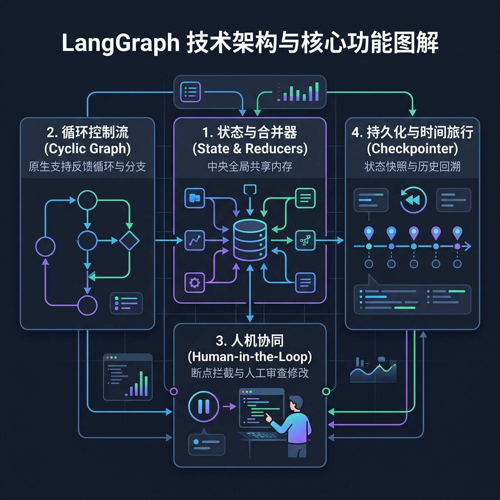

<!-- * 目录
{:toc} -->

# 引言

在过去的一两年中，大语言模型（LLM）的应用开发经历了翻天覆地的变化。我们从最初简单的 **Prompt 工程**（单次问答），过渡到了将多个步骤串联起来的 **Chain（链式工作流）**。但随着业务场景的复杂化，开发者们发现，真实的业务逻辑往往不是一条笔直的单行道，而是需要：
- **循环与迭代**：例如，Agent 生成代码后需要运行测试，报错了要返回去修改，直到测试通过。
- **状态维护（Memory）**：在复杂的跨步骤任务中，Agent 需要持续记录上下文、变量和中间结果。
- **人机协同（Human-in-the-Loop）**：在关键决策点暂停，等待人工审核或修改，再继续执行。

传统的链式框架（如传统的 LangChain）在处理这些**有循环（Cyclic）且需要精细状态管理**的复杂场景时会显得捉襟见肘。为此，LangChain 团队推出了专门的框架——**LangGraph**。


---

# 什么是 LangGraph？

**LangGraph** 是一个用于构建**状态化（Stateful）**和**多角色（Multi-actor）** LLM 应用的库。它允许你将工作流定义为一个**图（Graph）**结构，其中：
- **Node（节点）** 代表步骤或动作（例如：调用 LLM、执行 Tool、查询数据库）。
- **Edge（边）** 代表控制流，它决定了执行完一个步骤后下一步该去哪里（支持条件分支和循环）。
- **State（状态）** 则是贯穿整个图的共享内存，每个节点都可以读取并更新这个状态。

与只支持有向无环图（DAG）的传统工作流引擎不同，LangGraph **原生支持循环（Cycles）**。这使得它成为构建 **AI Agent**（特别是需要自我反思、纠错和自主决策的复杂 Agent）的首选框架。

<div align="center">
  
  <figcaption><em>图 1：LangGraph 核心架构与四大核心特征（状态与合并器、循环控制流、人机协同、持久化与时间旅行）</em></figcaption>
</div>

---

# LangGraph vs LangChain

很多初学者会产生疑问：既然已经有了 LangChain，为什么还要学 LangGraph？它们是什么关系？

其实，它们并不是替代关系，而是**互补**关系：

| 特性         | LangChain (LCEL)               | LangGraph                                |
| :----------- | :----------------------------- | :--------------------------------------- |
| **核心定位** | 组件集成与线性链式调用         | 状态化、多 Agent 循环工作流编排          |
| **控制流**   | 主要是线性的有向无环图（DAG）  | 原生支持循环（Cyclic）、反馈迭代         |
| **状态管理** | 弱，通常需要开发者手动传递参数 | 强，内置全局 State，自动持久化和合并更新 |
| **人机交互** | 较难原生支持中断与修改         | 内置支持断点（Interrupts）与状态修改     |
| **时间旅行** | 不支持                         | 支持回溯历史（Rewind）和分支运行（Fork） |

**总结**：LangChain 是你工具箱里的各种零件（如 Model 接口、Prompt 模板、Output Parser），而 LangGraph 是能够把这些零件拼装成高度自动化、可循环、可交互的复杂机器的“控制中枢”。节点 Node 本身可以直接嵌入 LCEL 表达式或 Runnable 实例。

---

# LangGraph 的三大核心概念

要掌握 LangGraph，只需要理解三个最基础的概念：**State（状态）**、**Nodes（节点）** 和 **Edges（边）**。

### 1. State (状态)
State 是整个图的**共享内存**（通常定义为 Python 的 `TypedDict` 或 Pydantic 模型）。
* 图中的每个节点在执行时，都会接收到当前的 State。
* 节点执行完毕后，会返回一个字典来更新 State。
* **Reducer（合并器）**：你可以为 State 中的某个字段指定合并规则。例如，在处理对话消息列表时，使用 `Annotated[list, add_messages]`（来自 `langgraph.graph.message`）可以避免简单覆盖，实现按消息 ID 追加或更新历史消息。

### 2. Nodes (节点)
Nodes 是图中的执行单元。每个 Node 通常是一个 Python 函数或 LangChain 表达式（LCEL Runnable）。
* 它的函数签名非常简单：接收 `State`，返回一个包含状态更新的 `dict`。
* 示例：
  ```python
  def assistant_node(state: MyState):
      # 1. 从 state 中读取信息
      # 2. 调用 LLM 或执行某种逻辑
      # 3. 返回要更新/添加的字段
      return {"messages": ["LLM 的回复内容"]}
  ```

### 3. Edges (边)
Edges 决定了节点之间的跳转逻辑，分为两种：
* **普通边（Deterministic Edges）**：固定的路由。例如节点 A 执行完后，必定进入节点 B。
* **条件边（Conditional Edges）**：动态的路由。它通过一个**路由函数（Router Function）**来判断当前 State，从而决定下一步走向哪个节点（或结束程序）。例如：如果 LLM 的回复中包含工具调用，则跳转到 `tools` 节点；否则跳转到结束节点 `END`。

---

# LangGraph 的四大核心特征

在实际生产环境中，大模型的不可控性非常高，因此我们需要框架提供强大的控制力和调试能力。LangGraph 带来了以下四个关键的核心特征：

### 1. 内置持久化与 Checkpointer
LangGraph 提供了一个持久化层。当你在编译图时传入一个 `Checkpointer`（如内存版的 `MemorySaver` 或数据库版的 `SqliteSaver`），图在每一步执行完（Super-step）后，都会自动将当前状态的快照写入数据库。
* **崩溃恢复**：如果服务中断或报错，可以从上一个成功的快照直接恢复，而不需要重新运行之前的昂贵调用。
* **多轮对话支持**：能够轻松维持用户的历史会话状态。

### 2. 人机协同（Human-in-the-Loop）
在很多严肃场景（如自动发邮件、转账或删除数据）中，我们不能完全信任大模型的决定。
LangGraph 允许你设置 **Breakpoints（断点）**。当图运行到特定节点前时会**自动暂停**，将控制权交还给人类。人类可以：
1. **批准（Approve）**：不做修改，直接让 Agent 继续执行。
2. **编辑（Edit）**：修改 Agent 的状态（如修改它生成的 SQL 语句）后再继续。
3. **反馈（Feedback）**：给 Agent 输入提示词，让它重新思考。

### 3. 时间旅行（Time-Travel）
得益于 Checkpointer 对每一步状态的完整记录，LangGraph 支持“时间旅行”：
* **回溯历史（Rewind）**：查看 Agent 在过去某一步的完整 State。
* **分叉运行（Forking）**：回到过去的某一步，修改状态，然后从该点走一条完全不同的分支路径。这在调试和 Agent 行为测试中极其强大。

### 4. 流式输出（Streaming）
LangGraph 原生支持丰富的流式传输：
* **Node 级流式**：每当一个节点执行完毕，实时推送状态变化。
* **Token 级流式**：流式推送 LLM 吐出的每一个字符。

---

# 总结

LangGraph 不仅是对 LangChain 框架的有力补充，更是构建下一代复杂 LLM 智能体（Agent）的基础设施。它通过直观的 **State、Node、Edge** 图模型，完美化解了循环工作流的痛点，并把 **持久化**、**人机协同**、**时间旅行** 等复杂工程问题封装为开箱即用的特性。

如果你正在构建复杂的 RAG 管道、自动代码生成器、客户服务 Agent 或多机器人协同系统，那么 LangGraph 绝对是你不容错过的利器。

---

# 参考资料
* [LangGraph 官方文档](https://langchain-ai.github.io/langgraph/)
* [LangGraph GitHub 仓库](https://github.com/langchain-ai/langgraph)
* [LangChain Blog](https://blog.langchain.dev/)
